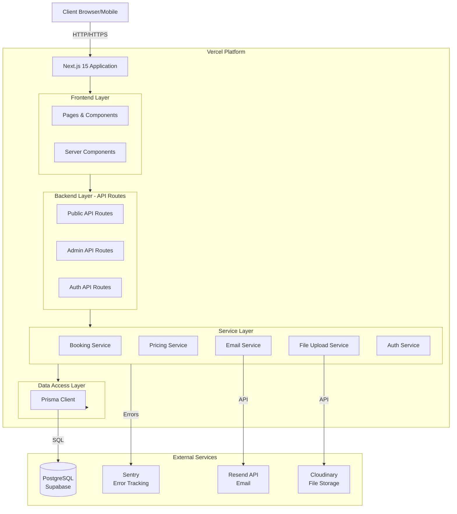
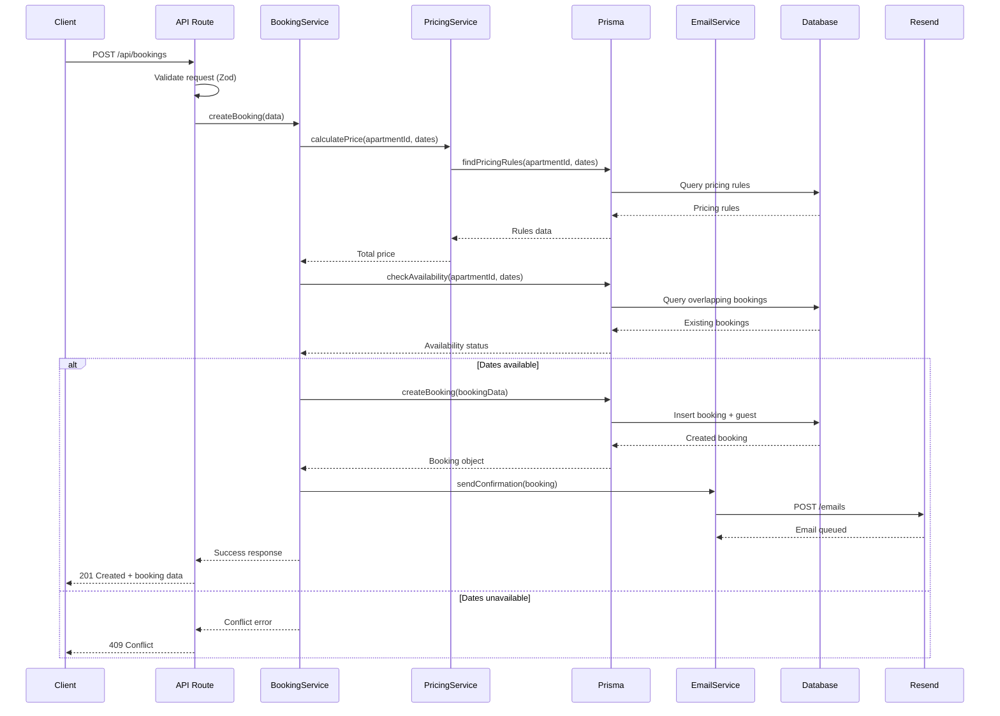
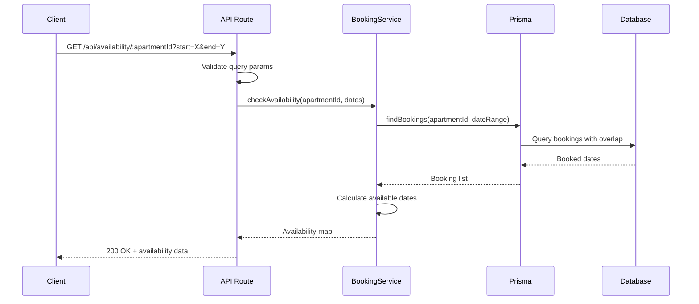
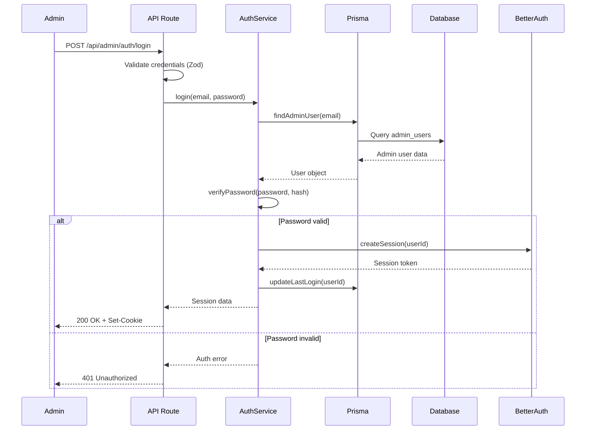

# Booking App Backend Architecture Document

## Change Log

| Date       | Version | Description                  | Author              |
| ---------- | ------- | ---------------------------- | ------------------- |
| 2025-01-01 | v1.0    | Initial backend architecture | Winston (Architect) |

## Introduction

This document outlines the backend architecture for the Booking App for Two Apartments, focusing on the server-side components, API design, database structure, and backend services. This architecture is designed to work seamlessly with the frontend architecture documented in `docs/ui-architecture.md`.

**Relationship to Frontend Architecture:**
The frontend architecture document defines the client-side implementation. This backend architecture provides the server-side API, data persistence, business logic, and external service integrations that power the booking system.

### Starter Template

**Decision:** Next.js 15 Full-Stack Monolith

The project uses Next.js 15 as both the frontend framework and backend API platform through Next.js API Routes. This eliminates the need for a separate backend starter template, as Next.js provides a unified full-stack solution.

**Rationale:**

- Single deployment target (Vercel)
- Shared TypeScript types between frontend and backend
- Built-in API Routes with serverless architecture
- Simplified development workflow
- Excellent performance with edge computing capabilities

## High Level Architecture

### Technical Summary

The Booking App backend follows a **serverless monolith** architecture built on Next.js 15 API Routes. The system uses Prisma ORM for database abstraction with PostgreSQL in production (SQLite for development), BetterAuth for authentication, and integrates with external services for email (Resend), file storage (Cloudinary), and monitoring (Sentry). The architecture emphasizes simplicity, type safety, and rapid development while maintaining production-ready security and scalability. All business logic is organized in service layers with clear separation between API routes, services, and data access, ensuring testability and maintainability.

### High Level Overview

**Architectural Style:** Serverless Monolith with Next.js API Routes

**Repository Structure:** Monorepo

- Single Next.js project containing frontend, backend, and shared utilities
- Unified deployment to Vercel
- Shared TypeScript types and configurations

**Service Architecture:**

- **Next.js API Routes** serve as serverless functions on Vercel
- **Prisma ORM** provides type-safe database access
- **Service Layer** contains business logic separated from API routes
- **Middleware** handles authentication, validation, and rate limiting
- **External Services** integrated via service adapters

**Primary Data Flow:**

1. Client request → Next.js API Route
2. API Route → Middleware (auth, validation, rate limiting)
3. API Route → Service Layer (business logic)
4. Service Layer → Prisma ORM → Database
5. Service Layer → External Services (email, file storage)
6. Response back through the chain to client

**Key Architectural Decisions:**

- **Serverless over Traditional Server:** Automatic scaling, pay-per-use pricing, zero server management
- **Monolith over Microservices:** Simpler development, easier deployment, shared types, appropriate for MVP scope
- **Prisma over Raw SQL:** Type safety, migrations management, excellent TypeScript integration
- **BetterAuth over NextAuth:** More flexible, better TypeScript support, modern authentication patterns

### High Level Project Diagram



### Architectural and Design Patterns

- **Repository Pattern:** Prisma acts as the repository layer, abstracting database operations with type-safe queries - _Rationale:_ Provides clean separation between data access and business logic, enables easier testing and potential database migration

- **Service Layer Pattern:** Business logic encapsulated in service classes separate from API routes - _Rationale:_ Promotes code reusability, testability, and maintains thin controllers (API routes)

- **Middleware Pattern:** Authentication, validation, and rate limiting implemented as composable middleware - _Rationale:_ Ensures consistent security and validation across all API routes, reduces code duplication

- **Dependency Injection (Lightweight):** Services receive dependencies via constructor injection - _Rationale:_ Improves testability by allowing mock injection during tests

- **API Gateway Pattern:** Next.js API Routes act as a unified gateway for all backend operations - _Rationale:_ Single entry point simplifies security, monitoring, and request handling

- **Serverless Architecture:** Each API route deploys as an independent serverless function - _Rationale:_ Automatic scaling, cost efficiency, zero server maintenance

- **Validation at Boundary:** All external inputs validated at API route level using Zod schemas - _Rationale:_ Prevents invalid data from entering the system, provides type safety

## Tech Stack

### Cloud Infrastructure

- **Provider:** Vercel (primary hosting), Supabase (database hosting)
- **Key Services:**
  - Vercel Edge Network (CDN)
  - Vercel Serverless Functions (API Routes)
  - Vercel Edge Config (rate limiting configuration)
  - Supabase PostgreSQL (managed database)
  - Supabase Storage (alternative to Cloudinary)
- **Deployment Regions:** Global (Vercel Edge), EU/US (database primary regions)

### Technology Stack Table

| Category               | Technology                 | Version | Purpose                                 | Rationale                                                                  |
| ---------------------- | -------------------------- | ------- | --------------------------------------- | -------------------------------------------------------------------------- |
| **Runtime**            | Node.js                    | 20.x    | JavaScript runtime for server-side code | LTS version, stable, excellent ecosystem, Vercel optimized                 |
| **Language**           | TypeScript                 | 5.3+    | Primary development language            | Strong typing, excellent tooling, shared with frontend                     |
| **Framework**          | Next.js                    | 15+     | Full-stack framework with API Routes    | Unified frontend/backend, serverless deployment, excellent DX              |
| **ORM**                | Prisma                     | 5.x     | Database ORM and query builder          | Type-safe queries, migration management, excellent TypeScript integration  |
| **Database (Dev)**     | SQLite                     | 3.x     | Local development database              | Zero configuration, file-based, fast for development                       |
| **Database (Prod)**    | PostgreSQL                 | 15+     | Production database                     | ACID compliance, powerful features, mature ecosystem                       |
| **Database Hosting**   | Supabase                   | Latest  | Managed PostgreSQL hosting              | Excellent DX, built-in connection pooling, real-time capabilities (future) |
| **Authentication**     | BetterAuth                 | 1.x     | Authentication library                  | Modern, flexible, excellent TypeScript support                             |
| **Validation**         | Zod                        | 3.x     | Schema validation                       | Type-safe validation, excellent TypeScript inference, composable schemas   |
| **Email Service**      | Resend                     | 2.x     | Transactional email API                 | Modern API, React email templates support, excellent DX                    |
| **File Storage**       | Cloudinary                 | 1.x     | Image upload and optimization           | Automatic image optimization, CDN delivery, transformations                |
| **Rate Limiting**      | @upstash/ratelimit         | 1.x     | API rate limiting                       | Serverless-friendly, Redis-based, simple API                               |
| **Error Tracking**     | Sentry                     | 7.x     | Error monitoring and tracking           | Comprehensive error tracking, performance monitoring, alerts               |
| **Testing Framework**  | Jest                       | 29.x    | Unit and integration testing            | Industry standard, excellent ecosystem, snapshot testing                   |
| **API Testing**        | Supertest                  | 6.x     | HTTP API testing                        | Clean API for testing Express-like routes                                  |
| **Test Database**      | @testcontainers/postgresql | 10.x    | Integration test database               | Real PostgreSQL in tests, consistent with production                       |
| **Code Quality**       | ESLint + Prettier          | Latest  | Linting and formatting                  | Code consistency, catch errors early                                       |
| **Git Hooks**          | Husky + lint-staged        | Latest  | Pre-commit checks                       | Prevent bad code from being committed                                      |
| **Environment Config** | dotenv-cli                 | 7.x     | Environment variable management         | Secure configuration management                                            |
| **Date Handling**      | date-fns                   | 3.x     | Date manipulation                       | Lightweight, tree-shakeable, excellent TypeScript support                  |
| **UUID Generation**    | uuid                       | 9.x     | Unique ID generation                    | Standard UUID generation for booking confirmation codes                    |
| **Password Hashing**   | bcrypt                     | 5.x     | Password hashing                        | Industry standard, secure password storage                                 |
| **Logging**            | pino                       | 8.x     | Structured logging                      | Fast, low overhead, JSON structured logs                                   |

## Data Models

### Apartment Model

**Purpose:** Represents a rental apartment with its details, photos, and base pricing information

**Key Attributes:**

- `id`: String (UUID) - Unique identifier
- `name`: String - Apartment name (e.g., "Cozy Studio Downtown")
- `description`: String - Detailed description
- `maxGuests`: Integer - Maximum number of guests allowed
- `basePricePerNight`: Decimal - Default nightly rate
- `photos`: String[] - Array of photo URLs
- `amenities`: JSON - Structured amenity data
- `status`: Enum (active, maintenance, inactive) - Current status
- `createdAt`: DateTime - Creation timestamp
- `updatedAt`: DateTime - Last update timestamp

**Relationships:**

- One-to-Many with Booking (an apartment has many bookings)
- One-to-Many with PricingRule (an apartment has many pricing rules)

### Guest Model

**Purpose:** Stores guest information for bookings and communication

**Key Attributes:**

- `id`: String (UUID) - Unique identifier
- `firstName`: String - Guest's first name
- `lastName`: String - Guest's last name
- `email`: String - Guest's email (unique)
- `phone`: String - Contact phone number
- `notes`: String (optional) - Admin notes about the guest
- `createdAt`: DateTime - Creation timestamp
- `updatedAt`: DateTime - Last update timestamp

**Relationships:**

- One-to-Many with Booking (a guest can have multiple bookings)

### Booking Model

**Purpose:** Core entity representing a reservation for an apartment

**Key Attributes:**

- `id`: String (UUID) - Unique identifier
- `apartmentId`: String (UUID) - Foreign key to Apartment
- `guestId`: String (UUID) - Foreign key to Guest
- `confirmationCode`: String - Unique 8-character booking code
- `startDate`: Date - Check-in date
- `endDate`: Date - Check-out date
- `numberOfGuests`: Integer - Number of guests
- `totalPrice`: Decimal - Total booking price
- `status`: Enum (pending, confirmed, cancelled, completed) - Booking status
- `notes`: String (optional) - Special requests or admin notes
- `createdAt`: DateTime - Creation timestamp
- `updatedAt`: DateTime - Last update timestamp
- `cancelledAt`: DateTime (optional) - Cancellation timestamp

**Relationships:**

- Many-to-One with Apartment
- Many-to-One with Guest

**Business Rules:**

- Confirmation code must be unique and URL-safe
- Start date must be before end date
- Number of guests cannot exceed apartment maxGuests
- Cannot have overlapping bookings for the same apartment

### PricingRule Model

**Purpose:** Defines seasonal or special pricing for specific date ranges

**Key Attributes:**

- `id`: String (UUID) - Unique identifier
- `apartmentId`: String (UUID) - Foreign key to Apartment
- `name`: String - Rule name (e.g., "Summer Peak Season")
- `startDate`: Date - Rule start date
- `endDate`: Date - Rule end date
- `pricePerNight`: Decimal - Special price for this period
- `minStayDuration`: Integer (optional) - Minimum stay requirement
- `priority`: Integer - Priority for overlapping rules (higher wins)
- `active`: Boolean - Whether rule is currently active
- `createdAt`: DateTime - Creation timestamp
- `updatedAt`: DateTime - Last update timestamp

**Relationships:**

- Many-to-One with Apartment

**Business Rules:**

- Start date must be before end date
- Multiple rules can overlap (priority determines which applies)
- If no rule matches, apartment basePricePerNight is used

### Admin User Model

**Purpose:** Stores admin authentication and profile information

**Key Attributes:**

- `id`: String (UUID) - Unique identifier
- `email`: String - Login email (unique)
- `passwordHash`: String - Bcrypt hashed password
- `name`: String - Admin name
- `role`: Enum (owner, admin) - User role
- `createdAt`: DateTime - Creation timestamp
- `updatedAt`: DateTime - Last update timestamp
- `lastLoginAt`: DateTime (optional) - Last login timestamp

**Relationships:**

- None (single admin user for MVP)

**Business Rules:**

- Email must be unique
- Password must be hashed using bcrypt
- Only one owner role allowed

## Database Schema

### Prisma Schema

```prisma
// prisma/schema.prisma

generator client {
  provider = "prisma-client-js"
}

datasource db {
  provider = "postgresql"
  url      = env("DATABASE_URL")
}

enum ApartmentStatus {
  ACTIVE
  MAINTENANCE
  INACTIVE
}

enum BookingStatus {
  PENDING
  CONFIRMED
  CANCELLED
  COMPLETED
}

enum AdminRole {
  OWNER
  ADMIN
}

model Apartment {
  id                String          @id @default(uuid())
  name              String
  description       String          @db.Text
  maxGuests         Int
  basePricePerNight Decimal         @db.Decimal(10, 2)
  photos            String[]
  amenities         Json
  status            ApartmentStatus @default(ACTIVE)
  createdAt         DateTime        @default(now())
  updatedAt         DateTime        @updatedAt

  bookings     Booking[]
  pricingRules PricingRule[]

  @@map("apartments")
}

model Guest {
  id        String   @id @default(uuid())
  firstName String
  lastName  String
  email     String   @unique
  phone     String
  notes     String?  @db.Text
  createdAt DateTime @default(now())
  updatedAt DateTime @updatedAt

  bookings Booking[]

  @@index([email])
  @@map("guests")
}

model Booking {
  id               String        @id @default(uuid())
  apartmentId      String
  guestId          String
  confirmationCode String        @unique @db.VarChar(8)
  startDate        DateTime      @db.Date
  endDate          DateTime      @db.Date
  numberOfGuests   Int
  totalPrice       Decimal       @db.Decimal(10, 2)
  status           BookingStatus @default(PENDING)
  notes            String?       @db.Text
  createdAt        DateTime      @default(now())
  updatedAt        DateTime      @updatedAt
  cancelledAt      DateTime?

  apartment Apartment @relation(fields: [apartmentId], references: [id], onDelete: Cascade)
  guest     Guest     @relation(fields: [guestId], references: [id], onDelete: Cascade)

  @@index([apartmentId, startDate, endDate])
  @@index([confirmationCode])
  @@index([status])
  @@index([guestId])
  @@map("bookings")
}

model PricingRule {
  id               String   @id @default(uuid())
  apartmentId      String
  name             String
  startDate        DateTime @db.Date
  endDate          DateTime @db.Date
  pricePerNight    Decimal  @db.Decimal(10, 2)
  minStayDuration  Int?
  priority         Int      @default(0)
  active           Boolean  @default(true)
  createdAt        DateTime @default(now())
  updatedAt        DateTime @updatedAt

  apartment Apartment @relation(fields: [apartmentId], references: [id], onDelete: Cascade)

  @@index([apartmentId, startDate, endDate, active])
  @@map("pricing_rules")
}

model AdminUser {
  id           String    @id @default(uuid())
  email        String    @unique
  passwordHash String
  name         String
  role         AdminRole @default(ADMIN)
  createdAt    DateTime  @default(now())
  updatedAt    DateTime  @updatedAt
  lastLoginAt  DateTime?

  @@map("admin_users")
}
```

### Database Indexes Strategy

**Performance-Critical Indexes:**

1. **Bookings by Apartment and Date Range:**
   - `@@index([apartmentId, startDate, endDate])` - Optimizes availability checks
2. **Booking Lookup by Confirmation Code:**
   - `@unique confirmationCode` + `@@index([confirmationCode])` - Fast guest booking lookup

3. **Bookings by Status:**
   - `@@index([status])` - Admin dashboard filtering

4. **Guest Email Lookup:**
   - `@unique email` + `@@index([email])` - Fast guest identification

5. **Pricing Rules Query:**
   - `@@index([apartmentId, startDate, endDate, active])` - Price calculation optimization

## Components

### API Routes Layer

**Responsibility:** Handle HTTP requests, validation, authentication, and response formatting

**Key Interfaces:**

- `GET /api/apartments` - List all apartments
- `GET /api/apartments/:id` - Get apartment details
- `GET /api/availability/:apartmentId` - Check availability
- `GET /api/pricing/:apartmentId` - Calculate pricing
- `POST /api/bookings` - Create booking
- `GET /api/bookings/:confirmationCode` - Get booking by code
- `PUT /api/bookings/:confirmationCode/cancel` - Cancel booking
- `POST /api/admin/auth/login` - Admin login
- `GET /api/admin/bookings` - List all bookings (admin)
- `POST /api/admin/bookings` - Create manual booking (admin)
- `PUT /api/admin/bookings/:id` - Update booking (admin)
- `POST /api/admin/pricing` - Create pricing rule (admin)

**Dependencies:** Middleware (auth, validation), Service Layer

**Technology Stack:** Next.js 15 API Routes, Zod validation, BetterAuth middleware

### Service Layer

**Responsibility:** Encapsulate business logic, data access orchestration, and external service integration

**Components:**

#### BookingService

- Create, read, update, delete bookings
- Check availability for date ranges
- Generate unique confirmation codes
- Validate booking constraints (guest capacity, date conflicts)

#### PricingService

- Calculate booking prices based on date range
- Apply pricing rules with priority
- Handle seasonal pricing logic
- Calculate totals and breakdowns

#### EmailService

- Send booking confirmations
- Send cancellation notifications
- Send admin alerts
- Template rendering with React Email

#### FileStorageService

- Upload apartment photos
- Delete photos
- Generate optimized image URLs
- Handle image transformations

#### AuthService

- Admin authentication
- Session management
- Password hashing and verification
- Token generation and validation

**Dependencies:** Prisma Client, External Services (Resend, Cloudinary)

**Technology Stack:** TypeScript classes, dependency injection pattern

### Data Access Layer (Prisma)

**Responsibility:** Type-safe database operations, migrations, and query optimization

**Key Operations:**

- CRUD operations for all models
- Complex queries (availability checks, pricing calculations)
- Transaction management for atomic operations
- Connection pooling and optimization

**Dependencies:** PostgreSQL database

**Technology Stack:** Prisma Client, Prisma Migrate

### Middleware Layer

**Responsibility:** Cross-cutting concerns like authentication, validation, rate limiting

**Components:**

#### Authentication Middleware

- Verify admin sessions
- Protect admin routes
- Handle unauthorized access

#### Validation Middleware

- Validate request bodies with Zod
- Return structured error responses
- Type-safe validation

#### Rate Limiting Middleware

- Prevent API abuse
- Implement per-IP rate limits
- Special limits for booking endpoints

**Dependencies:** BetterAuth, Zod, Upstash Rate Limit

**Technology Stack:** Next.js middleware pattern

## External APIs

### Resend Email API

- **Purpose:** Send transactional emails (booking confirmations, cancellations, admin notifications)
- **Documentation:** https://resend.com/docs
- **Base URL:** https://api.resend.com
- **Authentication:** API Key (Bearer token)
- **Rate Limits:** 100 emails/second (Pro plan)

**Key Endpoints Used:**

- `POST /emails` - Send email

**Integration Notes:**

- Use React Email for template rendering
- Implement retry logic for failed sends
- Queue emails for batch processing
- Store email send status in database

### Cloudinary API

- **Purpose:** Image upload, storage, optimization, and transformation
- **Documentation:** https://cloudinary.com/documentation
- **Base URL:** https://api.cloudinary.com/v1_1/{cloud_name}
- **Authentication:** API Key + API Secret
- **Rate Limits:** Varies by plan (generous for MVP)

**Key Endpoints Used:**

- `POST /image/upload` - Upload image
- `DELETE /resources/{public_id}` - Delete image

**Integration Notes:**

- Automatic image optimization (WebP conversion)
- Generate multiple sizes for responsive images
- Secure upload with signed requests
- Store Cloudinary URLs in database

### Sentry Error Tracking

- **Purpose:** Error monitoring, performance tracking, and alerts
- **Documentation:** https://docs.sentry.io
- **Integration:** SDK-based (no REST API calls)
- **Authentication:** DSN (Data Source Name)

**Integration Notes:**

- Capture all unhandled exceptions
- Track API performance
- User context for error attribution
- Release tracking for deployments

## Core Workflows

### Booking Creation Workflow



### Availability Check Workflow



### Admin Authentication Workflow



## REST API Specification

```yaml
openapi: 3.0.0
info:
  title: Booking App API
  version: 1.0.0
  description: API for two-apartment booking system

servers:
  - url: https://yourdomain.com/api
    description: Production server
  - url: http://localhost:3000/api
    description: Development server

components:
  securitySchemes:
    adminAuth:
      type: apiKey
      in: cookie
      name: admin-session

  schemas:
    Apartment:
      type: object
      properties:
        id:
          type: string
          format: uuid
        name:
          type: string
        description:
          type: string
        maxGuests:
          type: integer
        basePricePerNight:
          type: number
        photos:
          type: array
          items:
            type: string
        amenities:
          type: object
        status:
          type: string
          enum: [ACTIVE, MAINTENANCE, INACTIVE]

    Booking:
      type: object
      properties:
        id:
          type: string
          format: uuid
        confirmationCode:
          type: string
        apartmentId:
          type: string
        guestId:
          type: string
        startDate:
          type: string
          format: date
        endDate:
          type: string
          format: date
        numberOfGuests:
          type: integer
        totalPrice:
          type: number
        status:
          type: string
          enum: [PENDING, CONFIRMED, CANCELLED, COMPLETED]
        notes:
          type: string

    CreateBookingRequest:
      type: object
      required:
        - apartmentId
        - startDate
        - endDate
        - numberOfGuests
        - guestInfo
      properties:
        apartmentId:
          type: string
        startDate:
          type: string
          format: date
        endDate:
          type: string
          format: date
        numberOfGuests:
          type: integer
        guestInfo:
          type: object
          required:
            - firstName
            - lastName
            - email
            - phone
          properties:
            firstName:
              type: string
            lastName:
              type: string
            email:
              type: string
              format: email
            phone:
              type: string
        specialRequests:
          type: string

    ErrorResponse:
      type: object
      properties:
        error:
          type: string
        message:
          type: string
        code:
          type: string

paths:
  /apartments:
    get:
      summary: List all apartments
      responses:
        '200':
          description: List of apartments
          content:
            application/json:
              schema:
                type: array
                items:
                  $ref: '#/components/schemas/Apartment'

  /apartments/{id}:
    get:
      summary: Get apartment details
      parameters:
        - name: id
          in: path
          required: true
          schema:
            type: string
      responses:
        '200':
          description: Apartment details
          content:
            application/json:
              schema:
                $ref: '#/components/schemas/Apartment'
        '404':
          description: Apartment not found

  /availability/{apartmentId}:
    get:
      summary: Check apartment availability
      parameters:
        - name: apartmentId
          in: path
          required: true
          schema:
            type: string
        - name: start
          in: query
          required: true
          schema:
            type: string
            format: date
        - name: end
          in: query
          required: true
          schema:
            type: string
            format: date
      responses:
        '200':
          description: Availability data
          content:
            application/json:
              schema:
                type: object
                properties:
                  available:
                    type: boolean
                  bookedDates:
                    type: array
                    items:
                      type: string
                      format: date

  /pricing/{apartmentId}:
    get:
      summary: Calculate booking price
      parameters:
        - name: apartmentId
          in: path
          required: true
          schema:
            type: string
        - name: start
          in: query
          required: true
          schema:
            type: string
            format: date
        - name: end
          in: query
          required: true
          schema:
            type: string
            format: date
      responses:
        '200':
          description: Price calculation
          content:
            application/json:
              schema:
                type: object
                properties:
                  nights:
                    type: integer
                  pricePerNight:
                    type: number
                  totalPrice:
                    type: number
                  breakdown:
                    type: array
                    items:
                      type: object

  /bookings:
    post:
      summary: Create a new booking
      requestBody:
        required: true
        content:
          application/json:
            schema:
              $ref: '#/components/schemas/CreateBookingRequest'
      responses:
        '201':
          description: Booking created
          content:
            application/json:
              schema:
                $ref: '#/components/schemas/Booking'
        '400':
          description: Invalid request
          content:
            application/json:
              schema:
                $ref: '#/components/schemas/ErrorResponse'
        '409':
          description: Dates not available
          content:
            application/json:
              schema:
                $ref: '#/components/schemas/ErrorResponse'

  /bookings/{confirmationCode}:
    get:
      summary: Get booking by confirmation code
      parameters:
        - name: confirmationCode
          in: path
          required: true
          schema:
            type: string
      responses:
        '200':
          description: Booking details
          content:
            application/json:
              schema:
                $ref: '#/components/schemas/Booking'
        '404':
          description: Booking not found

  /bookings/{confirmationCode}/cancel:
    put:
      summary: Cancel a booking
      parameters:
        - name: confirmationCode
          in: path
          required: true
          schema:
            type: string
      responses:
        '200':
          description: Booking cancelled
          content:
            application/json:
              schema:
                $ref: '#/components/schemas/Booking'
        '400':
          description: Cannot cancel (too close to check-in)
        '404':
          description: Booking not found

  /admin/bookings:
    get:
      summary: List all bookings (admin)
      security:
        - adminAuth: []
      parameters:
        - name: status
          in: query
          schema:
            type: string
        - name: apartmentId
          in: query
          schema:
            type: string
      responses:
        '200':
          description: List of bookings
          content:
            application/json:
              schema:
                type: array
                items:
                  $ref: '#/components/schemas/Booking'
        '401':
          description: Unauthorized
```

_Note: This is a partial spec covering core endpoints. Full spec includes all admin endpoints, pricing management, and analytics._

## Source Tree

```
booking-app/
├── app/                                # Next.js 15 App Router
│   ├── api/                            # API Routes (Backend)
│   │   ├── admin/                      # Admin API endpoints
│   │   │   ├── analytics/
│   │   │   │   ├── dashboard/
│   │   │   │   │   └── route.ts        # Dashboard stats
│   │   │   │   └── revenue/
│   │   │   │       └── route.ts        # Revenue analytics
│   │   │   ├── auth/
│   │   │   │   ├── login/
│   │   │   │   │   └── route.ts        # Admin login
│   │   │   │   └── logout/
│   │   │   │       └── route.ts        # Admin logout
│   │   │   ├── bookings/
│   │   │   │   ├── [id]/
│   │   │   │   │   └── route.ts        # CRUD operations
│   │   │   │   └── route.ts            # List/Create bookings
│   │   │   ├── pricing/
│   │   │   │   ├── [id]/
│   │   │   │   │   └── route.ts        # Update/Delete pricing rule
│   │   │   │   └── route.ts            # List/Create pricing rules
│   │   │   └── apartments/
│   │   │       ├── [id]/
│   │   │       │   └── route.ts        # Update apartment
│   │   │       └── route.ts            # List apartments
│   │   ├── apartments/
│   │   │   ├── [id]/
│   │   │   │   └── route.ts            # Get apartment details
│   │   │   └── route.ts                # List apartments
│   │   ├── availability/
│   │   │   └── [apartmentId]/
│   │   │       └── route.ts            # Check availability
│   │   ├── bookings/
│   │   │   ├── [confirmationCode]/
│   │   │   │   ├── cancel/
│   │   │   │   │   └── route.ts        # Cancel booking
│   │   │   │   └── route.ts            # Get booking by code
│   │   │   └── route.ts                # Create booking
│   │   ├── pricing/
│   │   │   └── [apartmentId]/
│   │   │       └── route.ts            # Calculate pricing
│   │   └── upload/
│   │       └── route.ts                # Image upload endpoint
│   ├── (frontend pages...)             # Documented in frontend architecture
│   └── globals.css
├── lib/                                # Shared utilities and business logic
│   ├── services/                       # Service layer (business logic)
│   │   ├── booking-service.ts          # Booking operations
│   │   ├── pricing-service.ts          # Pricing calculations
│   │   ├── email-service.ts            # Email sending
│   │   ├── file-storage-service.ts     # File upload/storage
│   │   └── auth-service.ts             # Authentication
│   ├── middleware/                     # API middleware
│   │   ├── auth-middleware.ts          # Authentication checks
│   │   ├── validation-middleware.ts    # Zod validation
│   │   └── rate-limit-middleware.ts    # Rate limiting
│   ├── validations/                    # Zod schemas
│   │   ├── booking-schemas.ts          # Booking validation
│   │   ├── pricing-schemas.ts          # Pricing validation
│   │   └── auth-schemas.ts             # Auth validation
│   ├── utils/                          # Utility functions
│   │   ├── date-utils.ts               # Date calculations
│   │   ├── confirmation-code.ts        # Code generation
│   │   ├── logger.ts                   # Logging utility
│   │   └── error-handler.ts            # Error handling
│   ├── constants.ts                    # Application constants
│   ├── db.ts                           # Prisma client instance
│   └── email-templates/                # Email templates
│       ├── booking-confirmation.tsx    # React Email template
│       └── booking-cancellation.tsx    # React Email template
├── prisma/                             # Database schema and migrations
│   ├── schema.prisma                   # Prisma schema definition
│   ├── migrations/                     # Database migrations
│   │   └── 20250101000000_init/
│   │       └── migration.sql
│   └── seed.ts                         # Database seeding script
├── __tests__/                          # Test files
│   ├── api/                            # API route tests
│   │   ├── bookings.test.ts
│   │   ├── availability.test.ts
│   │   └── pricing.test.ts
│   ├── services/                       # Service layer tests
│   │   ├── booking-service.test.ts
│   │   ├── pricing-service.test.ts
│   │   └── email-service.test.ts
│   ├── utils/                          # Utility tests
│   │   └── date-utils.test.ts
│   └── integration/                    # Integration tests
│       ├── booking-flow.test.ts
│       └── admin-flow.test.ts
├── scripts/                            # Utility scripts
│   ├── seed-dev-data.ts                # Development data seeding
│   └── migrate-database.ts             # Database migration helper
├── .env.example                        # Environment variables template
├── .env.local                          # Local environment (gitignored)
├── .eslintrc.json                      # ESLint configuration
├── .prettierrc                         # Prettier configuration
├── jest.config.js                      # Jest configuration
├── next.config.js                      # Next.js configuration
├── package.json                        # Dependencies and scripts
├── pnpm-lock.yaml                      # Lockfile
├── tsconfig.json                       # TypeScript configuration
└── README.md                           # Project documentation
```

## Infrastructure and Deployment

### Infrastructure as Code

- **Tool:** Vercel configuration files (vercel.json)
- **Location:** Project root
- **Approach:** Configuration-based deployment (no traditional IaC needed for Vercel)

### Deployment Strategy

- **Strategy:** Continuous Deployment with Git-based workflow
- **CI/CD Platform:** GitHub Actions + Vercel
- **Pipeline Configuration:** `.github/workflows/ci.yml`

**Deployment Flow:**

1. Code pushed to GitHub
2. GitHub Actions runs tests and linting
3. Vercel automatically deploys on success
4. Preview deployments for pull requests
5. Production deployment on merge to main

### Environments

- **Development:** Local development with SQLite database
- **Preview:** Vercel preview deployments for PR testing
- **Production:** Vercel production deployment with PostgreSQL (Supabase)

### Environment Promotion Flow

```
Feature Branch → Pull Request → Preview Deployment → Code Review
                                         ↓
                                    Merge to Main
                                         ↓
                              Production Deployment
```

### Rollback Strategy

- **Primary Method:** Vercel instant rollback to previous deployment
- **Trigger Conditions:** Error rate spike, critical bugs, performance degradation
- **Recovery Time Objective:** < 5 minutes (instant rollback via Vercel dashboard)

## Error Handling Strategy

### General Approach

- **Error Model:** Structured error objects with HTTP status codes and error codes
- **Exception Hierarchy:**
  - `ApiError` (base class)
    - `ValidationError` (400)
    - `AuthenticationError` (401)
    - `AuthorizationError` (403)
    - `NotFoundError` (404)
    - `ConflictError` (409)
    - `RateLimitError` (429)
    - `InternalServerError` (500)
- **Error Propagation:** Errors bubble up from services to API routes, caught and formatted consistently

### Logging Standards

- **Library:** pino v8.x
- **Format:** JSON structured logs
- **Levels:**
  - `fatal` - Critical errors requiring immediate attention
  - `error` - Runtime errors
  - `warn` - Warning conditions
  - `info` - General informational messages
  - `debug` - Detailed debugging information
  - `trace` - Very detailed tracing information
- **Required Context:**
  - Correlation ID: UUID per request (in headers)
  - Service Context: API route path, method
  - User Context: Guest email (if authenticated), admin ID (if admin)
  - Timestamp, log level, message

### Error Handling Patterns

#### External API Errors

- **Retry Policy:** Exponential backoff (1s, 2s, 4s) for transient failures
- **Circuit Breaker:** Open circuit after 5 consecutive failures, half-open after 30s
- **Timeout Configuration:**
  - Email API: 10s timeout
  - File upload: 30s timeout
  - Database: 5s timeout
- **Error Translation:** External errors mapped to internal `ApiError` types with user-friendly messages

#### Business Logic Errors

- **Custom Exceptions:**
  - `BookingConflictError` - Overlapping booking dates
  - `InvalidDateRangeError` - End date before start date
  - `GuestCapacityExceededError` - Too many guests
  - `MinimumStayNotMetError` - Booking shorter than minimum
- **User-Facing Errors:** Clear, actionable messages (e.g., "These dates are no longer available. Please select different dates.")
- **Error Codes:** Structured codes for client-side handling (e.g., `BOOKING_CONFLICT`, `INVALID_DATES`)

#### Data Consistency

- **Transaction Strategy:** Use Prisma transactions for atomic operations (booking creation + guest creation)
- **Compensation Logic:** Rollback booking on email send failure with retry queue
- **Idempotency:** Confirmation codes prevent duplicate bookings, idempotency keys for payment operations (future)

## Coding Standards

### Core Standards

- **Languages & Runtimes:** TypeScript 5.3+ (strict mode), Node.js 20.x LTS
- **Style & Linting:** ESLint with Next.js config, Prettier with default settings, single quotes, semicolons, 2-space indentation
- **Test Organization:**
  - Unit tests: `__tests__/<component>/<file>.test.ts`
  - Integration tests: `__tests__/integration/<feature>.test.ts`
  - Test files co-located with source when appropriate

### Naming Conventions

| Element          | Convention       | Example                         |
| ---------------- | ---------------- | ------------------------------- |
| API Routes       | kebab-case       | `booking-confirmation/route.ts` |
| Services         | PascalCase       | `BookingService`                |
| Functions        | camelCase        | `calculateTotalPrice()`         |
| Constants        | UPPER_SNAKE_CASE | `MAX_GUESTS_PER_BOOKING`        |
| Interfaces/Types | PascalCase       | `BookingData`, `PricingRule`    |
| Database Tables  | snake_case       | `pricing_rules`, `admin_users`  |

### Critical Rules

- **Never use `any` type:** Use `unknown` and type guards instead - enforces type safety
- **Always validate API inputs:** Use Zod schemas at API boundaries before processing
- **Use Prisma for all database queries:** Never write raw SQL - ensures type safety and prevents SQL injection
- **Handle errors with try-catch:** All async operations must have error handling
- **Use environment variables for secrets:** Never hardcode API keys, database URLs, or passwords
- **Log with correlation IDs:** Every request must have a unique correlation ID for tracing
- **Use transactions for multi-step operations:** Booking creation + guest creation must be atomic
- **Implement rate limiting:** All public API endpoints must have rate limits
- **Hash passwords with bcrypt:** Admin passwords must use bcrypt with salt rounds >= 10
- **Sanitize user inputs:** Prevent XSS by sanitizing all user-provided content before display

## Test Strategy and Standards

### Testing Philosophy

- **Approach:** Test-Driven Development encouraged but not mandatory
- **Coverage Goals:**
  - Unit tests: 80% code coverage
  - API routes: 100% coverage (critical)
  - Services: 90% coverage
  - Utils: 85% coverage
- **Test Pyramid:**
  - 70% Unit tests (fast, isolated)
  - 20% Integration tests (realistic)
  - 10% E2E tests (critical flows)

### Test Types and Organization

#### Unit Tests

- **Framework:** Jest v29.x with TypeScript
- **File Convention:** `<component-name>.test.ts` (e.g., `booking-service.test.ts`)
- **Location:** `__tests__/<category>/` directory
- **Mocking Library:** Jest built-in mocks + `jest-mock-extended` for TypeScript
- **Coverage Requirement:** 80% minimum

**AI Agent Requirements:**

- Generate tests for all public methods and exported functions
- Cover edge cases (empty inputs, null values, boundary conditions)
- Test error conditions and exception handling
- Follow AAA pattern (Arrange, Act, Assert)
- Mock all external dependencies (Prisma, email service, file storage)

#### Integration Tests

- **Scope:** API routes with real database, mocked external services
- **Location:** `__tests__/integration/`
- **Test Infrastructure:**
  - **Database:** Testcontainers PostgreSQL for realistic testing
  - **Email:** Mock email service (no real emails sent)
  - **File Storage:** Mock Cloudinary service

**Example Test Structure:**

```typescript
describe('POST /api/bookings', () => {
	beforeAll(async () => {
		// Start test database container
		await startTestDatabase()
	})

	beforeEach(async () => {
		// Clear database and seed test data
		await prisma.booking.deleteMany()
		await seedTestApartments()
	})

	it('should create booking with valid data', async () => {
		const response = await request(app)
			.post('/api/bookings')
			.send(validBookingData)

		expect(response.status).toBe(201)
		expect(response.body).toHaveProperty('confirmationCode')
	})
})
```

#### End-to-End Tests

- **Framework:** Playwright (or Cypress as alternative)
- **Scope:** Critical user journeys (guest booking flow, admin booking management)
- **Environment:** Separate test environment with test database
- **Test Data:** Seed scripts with known test data, cleanup after tests

### Test Data Management

- **Strategy:** Factory pattern with realistic test data
- **Fixtures:** JSON files in `__tests__/fixtures/`
- **Factories:** TypeScript factory functions (e.g., `createTestBooking()`)
- **Cleanup:** Automatic cleanup in `afterEach` hooks

### Continuous Testing

- **CI Integration:**
  1. Lint and type-check on every push
  2. Unit tests on pull requests
  3. Integration tests on merge to main
  4. E2E tests nightly and pre-release
- **Performance Tests:** Load testing with k6 for availability and pricing endpoints (future)
- **Security Tests:** OWASP dependency scanning, Snyk integration for vulnerability detection

## Security

### Input Validation

- **Validation Library:** Zod v3.x
- **Validation Location:** API route level (before business logic)
- **Required Rules:**
  - All external inputs MUST be validated with Zod schemas
  - Validation at API boundary before processing
  - Whitelist approach: define allowed values, reject everything else
  - Type coercion avoided (strict validation)

**Example:**

```typescript
const bookingSchema = z.object({
	apartmentId: z.string().uuid(),
	startDate: z.string().regex(/^\d{4}-\d{2}-\d{2}$/),
	endDate: z.string().regex(/^\d{4}-\d{2}-\d{2}$/),
	numberOfGuests: z.number().int().min(1).max(10),
})
```

### Authentication & Authorization

- **Auth Method:** BetterAuth with secure HTTP-only cookies
- **Session Management:** Server-side sessions with 7-day expiration
- **Required Patterns:**
  - Admin routes protected by authentication middleware
  - Session tokens rotated on privilege escalation
  - Logout invalidates server-side session immediately
  - No client-side session storage (cookies only)

### Secrets Management

- **Development:** `.env.local` file (gitignored)
- **Production:** Vercel Environment Variables (encrypted)
- **Code Requirements:**
  - NEVER hardcode secrets in code
  - Access via `process.env` only
  - No secrets in logs or error messages
  - Use different secrets per environment

### API Security

- **Rate Limiting:**
  - Booking endpoints: 5 requests/5 minutes per IP
  - Admin endpoints: 100 requests/minute per user
  - General API: 60 requests/minute per IP
- **CORS Policy:**
  - Allow only frontend origin in production
  - Credentials allowed for authenticated requests
- **Security Headers:**
  - `Strict-Transport-Security: max-age=31536000`
  - `X-Frame-Options: DENY`
  - `X-Content-Type-Options: nosniff`
  - `Referrer-Policy: strict-origin-when-cross-origin`
- **HTTPS Enforcement:** Automatic via Vercel (HTTP redirects to HTTPS)

### Data Protection

- **Encryption at Rest:** Database encryption via Supabase (AES-256)
- **Encryption in Transit:** TLS 1.3 for all connections
- **PII Handling:**
  - Guest emails and phone numbers considered PII
  - No PII in URL parameters or query strings
  - PII redacted from logs (mask email/phone)
  - GDPR compliance: guest data deletion on request
- **Logging Restrictions:**
  - Never log passwords (even hashed)
  - Never log session tokens
  - Never log full credit card numbers (future)
  - Mask email addresses in logs (e.g., `j***@example.com`)

### Dependency Security

- **Scanning Tool:** npm audit + Snyk GitHub integration
- **Update Policy:**
  - Security patches: within 48 hours
  - Minor updates: monthly review
  - Major updates: quarterly evaluation
- **Approval Process:** All new dependencies require code review approval

### Security Testing

- **SAST Tool:** ESLint security plugins, TypeScript strict mode
- **DAST Tool:** OWASP ZAP scans on preview deployments
- **Penetration Testing:** Quarterly external security audit (post-launch)

## QA Concerns Resolution

This section addresses critical concerns identified in the Pre-Implementation QA assessments (`docs/qa/assessments/`).

### C1: Rate Limiting Configuration (NFR6)

**Concern:** Rate limiting specification incomplete - missing sliding window algorithm, Redis key structure, and error response format.

**Resolution:**

#### Implementation Strategy

```typescript
// lib/middleware/rate-limit.ts
import { Ratelimit } from '@upstash/ratelimit'
import { Redis } from '@upstash/redis'
import { NextRequest, NextResponse } from 'next/server'
import { logger } from '@/lib/utils/logger'

// Rate limiter instances for different endpoint categories
export const bookingLimiter = new Ratelimit({
	redis: Redis.fromEnv(),
	limiter: Ratelimit.slidingWindow(5, '5 m'), // 5 requests per 5 minutes
	analytics: true,
	prefix: '@booking-app/bookings',
})

export const adminLimiter = new Ratelimit({
	redis: Redis.fromEnv(),
	limiter: Ratelimit.slidingWindow(100, '1 m'), // 100 requests per minute
	analytics: true,
	prefix: '@booking-app/admin',
})

export const generalLimiter = new Ratelimit({
	redis: Redis.fromEnv(),
	limiter: Ratelimit.slidingWindow(60, '1 m'), // 60 requests per minute
	analytics: true,
	prefix: '@booking-app/general',
})

// Rate limit middleware factory
export function createRateLimitMiddleware(limiter: Ratelimit) {
	return async (req: NextRequest): Promise<NextResponse | null> => {
		const ip = req.ip ?? req.headers.get('x-forwarded-for') ?? '127.0.0.1'
		const identifier = `${ip}:${req.nextUrl.pathname}`

		try {
			const { success, limit, remaining, reset } =
				await limiter.limit(identifier)

			if (!success) {
				logger.warn({
					msg: 'Rate limit exceeded',
					ip,
					path: req.nextUrl.pathname,
					identifier,
				})

				return NextResponse.json(
					{
						error: 'Too many requests',
						message:
							'You have exceeded the rate limit. Please try again later.',
						code: 'RATE_LIMIT_EXCEEDED',
					},
					{
						status: 429,
						headers: {
							'X-RateLimit-Limit': limit.toString(),
							'X-RateLimit-Remaining': remaining.toString(),
							'X-RateLimit-Reset': new Date(reset).toISOString(),
							'Retry-After': Math.ceil((reset - Date.now()) / 1000).toString(),
							'Content-Type': 'application/json',
						},
					}
				)
			}

			// Rate limit passed - add headers to response (handled in API route)
			return null
		} catch (error) {
			// Rate limiter failure should not block requests
			logger.error({
				msg: 'Rate limiter error',
				error,
				ip,
				path: req.nextUrl.pathname,
			})
			return null // Fail open
		}
	}
}

// Usage in API routes
export async function withRateLimit<T>(
	req: NextRequest,
	limiter: Ratelimit,
	handler: () => Promise<T>
): Promise<NextResponse | T> {
	const rateLimitResponse = await createRateLimitMiddleware(limiter)(req)
	if (rateLimitResponse) {
		return rateLimitResponse
	}
	return handler()
}
```

#### Redis Key Structure

**Pattern:** `@booking-app/{category}:{identifier}`

**Examples:**

- Booking endpoint: `@booking-app/bookings:192.168.1.1:/api/bookings`
- Admin endpoint: `@booking-app/admin:user-uuid-123:/api/admin/bookings`
- General API: `@booking-app/general:192.168.1.1:/api/apartments`

#### Error Response Format

```typescript
// Standard 429 Response
{
  "error": "Too many requests",
  "message": "You have exceeded the rate limit. Please try again later.",
  "code": "RATE_LIMIT_EXCEEDED"
}

// Response Headers
{
  "X-RateLimit-Limit": "5",           // Maximum requests allowed
  "X-RateLimit-Remaining": "0",       // Requests remaining in window
  "X-RateLimit-Reset": "2025-10-02T15:30:00.000Z", // Reset timestamp
  "Retry-After": "180"                // Seconds until retry allowed
}
```

#### Usage Examples

```typescript
// app/api/bookings/route.ts
import { NextRequest } from 'next/server'
import { withRateLimit, bookingLimiter } from '@/lib/middleware/rate-limit'
import { bookingService } from '@/lib/services/booking-service'

export async function POST(req: NextRequest) {
	return withRateLimit(req, bookingLimiter, async () => {
		const data = await req.json()
		// ... validation and booking creation
		const booking = await bookingService.createBooking(data)
		return NextResponse.json(booking, { status: 201 })
	})
}
```

#### Monitoring Strategy

```typescript
// lib/monitoring/rate-limit-alerts.ts
import { logger } from '@/lib/utils/logger'
import * as Sentry from '@sentry/nextjs'

export function trackRateLimitViolation(
	ip: string,
	path: string,
	identifier: string
) {
	logger.warn({
		msg: 'Rate limit violation',
		ip,
		path,
		identifier,
		timestamp: new Date().toISOString(),
	})

	// Send to Sentry for monitoring
	Sentry.captureMessage('Rate limit exceeded', {
		level: 'warning',
		tags: {
			ip,
			path,
		},
		extra: {
			identifier,
		},
	})
}

// Alert when violation rate exceeds 10% of requests
export function checkViolationThreshold(
	totalRequests: number,
	violations: number
) {
	const violationRate = violations / totalRequests
	if (violationRate > 0.1) {
		Sentry.captureMessage('High rate limit violation rate detected', {
			level: 'error',
			extra: {
				totalRequests,
				violations,
				violationRate: `${(violationRate * 100).toFixed(2)}%`,
			},
		})
	}
}
```

#### Testing

```typescript
// __tests__/middleware/rate-limit.test.ts
import { describe, it, expect, beforeEach } from '@jest/globals'
import { NextRequest } from 'next/server'
import {
	createRateLimitMiddleware,
	bookingLimiter,
} from '@/lib/middleware/rate-limit'

describe('Rate Limiting Middleware', () => {
	beforeEach(async () => {
		// Clear rate limit state before each test
		await redis.flushdb()
	})

	it('should allow requests within rate limit', async () => {
		const req = new NextRequest('http://localhost:3000/api/bookings', {
			method: 'POST',
			headers: { 'x-forwarded-for': '192.168.1.1' },
		})

		for (let i = 0; i < 5; i++) {
			const result = await createRateLimitMiddleware(bookingLimiter)(req)
			expect(result).toBeNull() // No rate limit response
		}
	})

	it('should block requests exceeding rate limit', async () => {
		const req = new NextRequest('http://localhost:3000/api/bookings', {
			method: 'POST',
			headers: { 'x-forwarded-for': '192.168.1.1' },
		})

		// Make 5 requests (at limit)
		for (let i = 0; i < 5; i++) {
			await createRateLimitMiddleware(bookingLimiter)(req)
		}

		// 6th request should be blocked
		const result = await createRateLimitMiddleware(bookingLimiter)(req)
		expect(result).not.toBeNull()
		expect(result?.status).toBe(429)

		const body = await result?.json()
		expect(body.code).toBe('RATE_LIMIT_EXCEEDED')
		expect(result?.headers.get('Retry-After')).toBeTruthy()
	})

	it('should include correct rate limit headers', async () => {
		const req = new NextRequest('http://localhost:3000/api/bookings', {
			method: 'POST',
			headers: { 'x-forwarded-for': '192.168.1.1' },
		})

		// Make 5 requests to hit limit
		for (let i = 0; i < 5; i++) {
			await createRateLimitMiddleware(bookingLimiter)(req)
		}

		const result = await createRateLimitMiddleware(bookingLimiter)(req)
		expect(result?.headers.get('X-RateLimit-Limit')).toBe('5')
		expect(result?.headers.get('X-RateLimit-Remaining')).toBe('0')
		expect(result?.headers.get('X-RateLimit-Reset')).toBeTruthy()
	})
})
```

**Status:** ✅ **RESOLVED** - Complete rate limiting specification with implementation, testing, and monitoring.

---

### C2: Concurrent Booking Strategy (NFR10)

**Concern:** Transaction isolation level and locking strategy not specified, preventing double-bookings under concurrent load.

**Resolution:**

#### Transaction Isolation Strategy

**Decision:** Use **Serializable** isolation level with pessimistic locking (SELECT FOR UPDATE)

**Rationale:**

- Strongest consistency guarantee
- Prevents phantom reads and concurrent booking conflicts
- Acceptable performance cost for low-frequency booking operations
- Industry standard for reservation systems

#### Implementation: Pessimistic Locking

```typescript
// lib/services/booking-service.ts
import { PrismaClient, BookingStatus, Prisma } from '@prisma/client'
import { logger } from '@/lib/utils/logger'
import {
	BookingConflictError,
	InvalidDateRangeError,
	GuestCapacityExceededError,
} from '@/lib/utils/errors'

export class BookingService {
	constructor(private prisma: PrismaClient) {}

	/**
	 * Create booking with pessimistic locking to prevent double-bookings
	 * @throws {BookingConflictError} if dates are unavailable
	 */
	async createBooking(data: CreateBookingData): Promise<Booking> {
		const correlationId = crypto.randomUUID()

		logger.info({
			msg: 'Creating booking with concurrency protection',
			correlationId,
			apartmentId: data.apartmentId,
			startDate: data.startDate,
			endDate: data.endDate,
		})

		return this.prisma.$transaction(
			async (tx) => {
				// Step 1: Lock all conflicting bookings with SELECT FOR UPDATE
				// This prevents other transactions from reading these rows until commit
				const conflictingBookings = await tx.$queryRaw<{ id: string }[]>`
					SELECT id FROM bookings
					WHERE apartment_id = ${data.apartmentId}
					  AND status IN ('PENDING', 'CONFIRMED')
					  AND (
						(start_date <= ${data.endDate} AND end_date >= ${data.startDate})
					  )
					FOR UPDATE
				`

				logger.debug({
					msg: 'Checked for conflicting bookings',
					correlationId,
					conflictCount: conflictingBookings.length,
				})

				if (conflictingBookings.length > 0) {
					throw new BookingConflictError(
						'These dates are no longer available. Please select different dates.',
						{
							apartmentId: data.apartmentId,
							requestedStart: data.startDate,
							requestedEnd: data.endDate,
							conflictingBookings: conflictingBookings.map((b) => b.id),
						}
					)
				}

				// Step 2: Validate apartment capacity
				const apartment = await tx.apartment.findUnique({
					where: { id: data.apartmentId },
					select: { maxGuests: true, status: true },
				})

				if (!apartment) {
					throw new NotFoundError('Apartment not found')
				}

				if (apartment.status !== 'ACTIVE') {
					throw new ValidationError('Apartment is not available for booking')
				}

				if (data.numberOfGuests > apartment.maxGuests) {
					throw new GuestCapacityExceededError(
						`Maximum ${apartment.maxGuests} guests allowed`,
						{
							requested: data.numberOfGuests,
							maximum: apartment.maxGuests,
						}
					)
				}

				// Step 3: Create or find guest
				const guest = await tx.guest.upsert({
					where: { email: data.guestInfo.email },
					update: {
						firstName: data.guestInfo.firstName,
						lastName: data.guestInfo.lastName,
						phone: data.guestInfo.phone,
					},
					create: {
						firstName: data.guestInfo.firstName,
						lastName: data.guestInfo.lastName,
						email: data.guestInfo.email,
						phone: data.guestInfo.phone,
					},
				})

				// Step 4: Calculate pricing
				const totalPrice = await this.pricingService.calculatePrice(
					data.apartmentId,
					data.startDate,
					data.endDate,
					tx
				)

				// Step 5: Generate unique confirmation code
				const confirmationCode = await this.generateUniqueConfirmationCode(tx)

				// Step 6: Create booking within the locked transaction
				const booking = await tx.booking.create({
					data: {
						apartmentId: data.apartmentId,
						guestId: guest.id,
						confirmationCode,
						startDate: data.startDate,
						endDate: data.endDate,
						numberOfGuests: data.numberOfGuests,
						totalPrice,
						status: 'PENDING',
						notes: data.specialRequests,
					},
					include: {
						apartment: true,
						guest: true,
					},
				})

				logger.info({
					msg: 'Booking created successfully',
					correlationId,
					bookingId: booking.id,
					confirmationCode: booking.confirmationCode,
				})

				return booking
			},
			{
				isolationLevel: Prisma.TransactionIsolationLevel.Serializable,
				timeout: 10000, // 10 second timeout
				maxWait: 5000, // Wait max 5s for transaction to start
			}
		)
	}

	/**
	 * Create booking with automatic retry on transaction conflicts
	 */
	async createBookingWithRetry(
		data: CreateBookingData,
		maxRetries = 3
	): Promise<Booking> {
		for (let attempt = 0; attempt <= maxRetries; attempt++) {
			try {
				return await this.createBooking(data)
			} catch (error) {
				// Prisma transaction conflict error code
				if (
					error instanceof Prisma.PrismaClientKnownRequestError &&
					error.code === 'P2034' &&
					attempt < maxRetries
				) {
					const backoffMs = Math.pow(2, attempt) * 100 // Exponential backoff
					logger.warn({
						msg: 'Transaction conflict, retrying',
						attempt: attempt + 1,
						maxRetries,
						backoffMs,
					})

					await sleep(backoffMs)
					continue
				}

				// Re-throw if not a transaction conflict or max retries exceeded
				throw error
			}
		}

		throw new Error('Max retries exceeded for booking creation')
	}

	private async generateUniqueConfirmationCode(
		tx: Prisma.TransactionClient
	): Promise<string> {
		let attempts = 0
		const maxAttempts = 10

		while (attempts < maxAttempts) {
			const code = generateConfirmationCode() // 8-character alphanumeric
			const existing = await tx.booking.findUnique({
				where: { confirmationCode: code },
			})

			if (!existing) {
				return code
			}

			attempts++
		}

		throw new Error('Failed to generate unique confirmation code')
	}
}

// Utility function for exponential backoff
function sleep(ms: number): Promise<void> {
	return new Promise((resolve) => setTimeout(resolve, ms))
}
```

#### Alternative: Optimistic Locking (Future Performance Optimization)

For higher throughput scenarios, implement optimistic locking with version fields:

```prisma
// prisma/schema.prisma
model Booking {
  // ... existing fields
  version Int @default(0) // Optimistic locking version
}
```

```typescript
// Optimistic locking implementation
async function updateBookingOptimistic(
	id: string,
	updates: Partial<Booking>
): Promise<Booking> {
	const currentBooking = await prisma.booking.findUnique({ where: { id } })

	if (!currentBooking) {
		throw new NotFoundError('Booking not found')
	}

	try {
		return await prisma.booking.update({
			where: {
				id,
				version: currentBooking.version, // Version check
			},
			data: {
				...updates,
				version: currentBooking.version + 1,
			},
		})
	} catch (error) {
		if (error.code === 'P2025') {
			// Record not found = version conflict
			throw new ConcurrentUpdateError(
				'Booking was modified by another user. Please refresh and try again.'
			)
		}
		throw error
	}
}
```

#### Concurrency Testing

```typescript
// __tests__/integration/concurrent-booking.test.ts
import { describe, it, expect, beforeEach } from '@jest/globals'
import { BookingService } from '@/lib/services/booking-service'
import { createTestApartment, createTestBookingData } from '../factories'

describe('Concurrent Booking Prevention', () => {
	let bookingService: BookingService

	beforeEach(async () => {
		await clearDatabase()
		bookingService = new BookingService(prisma)
	})

	it('should prevent double-booking with 10 concurrent requests', async () => {
		const apartment = await createTestApartment()
		const bookingData = createTestBookingData({
			apartmentId: apartment.id,
			startDate: '2025-06-15',
			endDate: '2025-06-20',
		})

		// Simulate 10 users trying to book simultaneously
		const promises = Array.from({ length: 10 }, () =>
			bookingService.createBookingWithRetry(bookingData).catch((error) => error)
		)

		const results = await Promise.all(promises)

		// Count successes and conflicts
		const successes = results.filter(
			(r) => !(r instanceof Error) && r.confirmationCode
		)
		const conflicts = results.filter((r) => r instanceof BookingConflictError)

		// Exactly 1 should succeed, 9 should fail with conflict
		expect(successes).toHaveLength(1)
		expect(conflicts).toHaveLength(9)

		// Verify only 1 booking exists in database
		const bookings = await prisma.booking.findMany({
			where: { apartmentId: apartment.id },
		})
		expect(bookings).toHaveLength(1)
	})

	it('should handle transaction retries on conflict', async () => {
		const apartment = await createTestApartment()
		const bookingData = createTestBookingData({
			apartmentId: apartment.id,
		})

		// First booking succeeds
		const booking1 = await bookingService.createBooking(bookingData)
		expect(booking1.confirmationCode).toBeTruthy()

		// Second booking with overlapping dates should fail after retries
		await expect(
			bookingService.createBookingWithRetry({
				...bookingData,
				startDate: booking1.startDate,
				endDate: booking1.endDate,
			})
		).rejects.toThrow(BookingConflictError)
	})
})
```

#### Load Testing

```javascript
// k6/concurrent-booking-test.js
import http from 'k6/http'
import { check, sleep } from 'k6'
import { Rate } from 'k6/metrics'

const conflictRate = new Rate('booking_conflicts')

export let options = {
	stages: [
		{ duration: '30s', target: 50 }, // Ramp up to 50 concurrent users
		{ duration: '1m', target: 50 }, // Stay at 50 users
		{ duration: '30s', target: 0 }, // Ramp down
	],
	thresholds: {
		booking_conflicts: ['rate<0.95'], // Less than 95% conflicts (at least 5% succeed)
		http_req_duration: ['p(95)<2000'], // 95% of requests under 2s
	},
}

export default function () {
	const payload = JSON.stringify({
		apartmentId: 'test-apt-1',
		startDate: '2025-06-15',
		endDate: '2025-06-20',
		numberOfGuests: 2,
		guestInfo: {
			firstName: `Guest${__VU}`, // Unique per virtual user
			lastName: 'Test',
			email: `guest${__VU}@test.com`,
			phone: '+11234567890',
		},
	})

	const res = http.post('http://localhost:3000/api/bookings', payload, {
		headers: { 'Content-Type': 'application/json' },
	})

	const success = check(res, {
		'booking created (201)': (r) => r.status === 201,
		'booking conflict (409)': (r) => r.status === 409,
		'response time OK': (r) => r.timings.duration < 2000,
	})

	conflictRate.add(res.status === 409)

	sleep(1)
}
```

**Status:** ✅ **RESOLVED** - Complete concurrency strategy with pessimistic locking, retry logic, and comprehensive testing.

---

### C3: Data Corruption from Concurrent Updates (R2)

**Concern:** Concurrent updates to booking status or pricing rules could lead to lost updates or inconsistent states.

**Resolution:**

#### Update Operations with Transaction Isolation

```typescript
// lib/services/booking-service.ts (continued)

/**
 * Update booking status with state transition validation
 * Prevents concurrent updates from corrupting booking state
 */
async updateBookingStatus(
	bookingId: string,
	newStatus: BookingStatus,
	adminId?: string
): Promise<Booking> {
	return this.prisma.$transaction(
		async (tx) => {
			// Lock the booking row for update
			const booking = await tx.booking.findUnique({
				where: { id: bookingId },
			});

			if (!booking) {
				throw new NotFoundError('Booking not found');
			}

			// Validate state transition
			if (!isValidStatusTransition(booking.status, newStatus)) {
				throw new InvalidStatusTransitionError(
					`Cannot transition from ${booking.status} to ${newStatus}`,
					{
						currentStatus: booking.status,
						requestedStatus: newStatus,
					}
				);
			}

			// Update with concurrency protection
			const updated = await tx.booking.update({
				where: { id: bookingId },
				data: {
					status: newStatus,
					...(newStatus === 'CANCELLED' && { cancelledAt: new Date() }),
				},
			});

			// Log state change for audit trail
			await tx.bookingAuditLog.create({
				data: {
					bookingId: booking.id,
					previousStatus: booking.status,
					newStatus: newStatus,
					changedBy: adminId ?? 'system',
					changedAt: new Date(),
				},
			});

			return updated;
		},
		{
			isolationLevel: Prisma.TransactionIsolationLevel.Serializable,
		}
	);
}

/**
 * Valid booking status transitions
 */
function isValidStatusTransition(
	current: BookingStatus,
	next: BookingStatus
): boolean {
	const validTransitions: Record<BookingStatus, BookingStatus[]> = {
		PENDING: ['CONFIRMED', 'CANCELLED'],
		CONFIRMED: ['COMPLETED', 'CANCELLED'],
		CANCELLED: [], // Terminal state
		COMPLETED: [], // Terminal state
	};

	return validTransitions[current]?.includes(next) ?? false;
}
```

#### Pricing Rule Updates with Conflict Detection

```typescript
// lib/services/pricing-service.ts

/**
 * Update pricing rule with overlap detection
 */
async updatePricingRule(
	ruleId: string,
	updates: Partial<PricingRule>
): Promise<PricingRule> {
	return this.prisma.$transaction(
		async (tx) => {
			const existingRule = await tx.pricingRule.findUnique({
				where: { id: ruleId },
			});

			if (!existingRule) {
				throw new NotFoundError('Pricing rule not found');
			}

			// Check for overlapping rules if dates are being updated
			if (updates.startDate || updates.endDate) {
				const startDate = updates.startDate ?? existingRule.startDate;
				const endDate = updates.endDate ?? existingRule.endDate;

				const overlappingRules = await tx.pricingRule.findMany({
					where: {
						apartmentId: existingRule.apartmentId,
						id: { not: ruleId }, // Exclude current rule
						active: true,
						AND: [
							{ startDate: { lte: endDate } },
							{ endDate: { gte: startDate } },
						],
					},
				});

				if (overlappingRules.length > 0) {
					throw new PricingRuleConflictError(
						'Pricing rule overlaps with existing rules',
						{
							conflictingRules: overlappingRules.map((r) => ({
								id: r.id,
								name: r.name,
								startDate: r.startDate,
								endDate: r.endDate,
							})),
						}
					);
				}
			}

			// Update with timestamp check (optimistic locking)
			const updated = await tx.pricingRule.update({
				where: {
					id: ruleId,
					updatedAt: existingRule.updatedAt, // Ensure no concurrent update
				},
				data: updates,
			});

			return updated;
		},
		{
			isolationLevel: Prisma.TransactionIsolationLevel.Serializable,
		}
	);
}
```

#### Testing Concurrent Updates

```typescript
// __tests__/services/concurrent-updates.test.ts

describe('Concurrent Update Protection', () => {
	it('should prevent lost updates on booking status', async () => {
		const booking = await createTestBooking({ status: 'PENDING' })

		// Simulate two admins trying to update status simultaneously
		const results = await Promise.allSettled([
			bookingService.updateBookingStatus(booking.id, 'CONFIRMED', 'admin1'),
			bookingService.updateBookingStatus(booking.id, 'CANCELLED', 'admin2'),
		])

		// One should succeed, one should fail with conflict/transition error
		const succeeded = results.filter((r) => r.status === 'fulfilled')
		const failed = results.filter((r) => r.status === 'rejected')

		expect(succeeded).toHaveLength(1)
		expect(failed).toHaveLength(1)

		// Final state should be deterministic (either CONFIRMED or CANCELLED)
		const finalBooking = await prisma.booking.findUnique({
			where: { id: booking.id },
		})
		expect(['CONFIRMED', 'CANCELLED']).toContain(finalBooking?.status)
	})
})
```

**Status:** ✅ **RESOLVED** - Transaction isolation and state validation prevent data corruption from concurrent updates.

---

### C4: Email Delivery Failures (R3)

**Concern:** Synchronous email sending could block booking creation if email service is unavailable.

**Resolution:**

#### Asynchronous Email Queue Implementation

```typescript
// lib/queue/email-queue.ts
import { Queue, Worker } from 'bullmq'
import { Redis } from 'ioredis'
import { emailService } from '@/lib/services/email-service'
import { logger } from '@/lib/utils/logger'

const redis = new Redis(process.env.REDIS_URL!)

export const emailQueue = new Queue('emails', {
	connection: redis,
	defaultJobOptions: {
		attempts: 3,
		backoff: {
			type: 'exponential',
			delay: 2000, // 2s, 4s, 8s
		},
		removeOnComplete: {
			age: 24 * 3600, // Keep completed jobs for 24 hours
		},
		removeOnFail: {
			age: 7 * 24 * 3600, // Keep failed jobs for 7 days
		},
	},
})

// Worker process for email sending
export const emailWorker = new Worker(
	'emails',
	async (job) => {
		const { type, data } = job.data

		logger.info({
			msg: 'Processing email job',
			jobId: job.id,
			type,
			attempt: job.attemptsMade + 1,
		})

		switch (type) {
			case 'booking-confirmation':
				await emailService.sendBookingConfirmation(data)
				break
			case 'booking-cancellation':
				await emailService.sendBookingCancellation(data)
				break
			case 'admin-notification':
				await emailService.sendAdminNotification(data)
				break
			default:
				throw new Error(`Unknown email type: ${type}`)
		}
	},
	{
		connection: redis,
		concurrency: 5, // Process 5 emails concurrently
	}
)

// Event handlers
emailWorker.on('completed', (job) => {
	logger.info({
		msg: 'Email sent successfully',
		jobId: job.id,
		type: job.data.type,
	})
})

emailWorker.on('failed', (job, error) => {
	logger.error({
		msg: 'Email sending failed',
		jobId: job?.id,
		type: job?.data.type,
		error: error.message,
		attempts: job?.attemptsMade,
	})
})
```

#### Decoupled Booking Creation

```typescript
// lib/services/booking-service.ts (updated)

async createBooking(data: CreateBookingData): Promise<Booking> {
	// Step 1: Create booking in database (blocking)
	const booking = await this.createBookingTransaction(data);

	// Step 2: Queue email asynchronously (non-blocking)
	try {
		await emailQueue.add(
			'booking-confirmation',
			{
				type: 'booking-confirmation',
				data: {
					bookingId: booking.id,
					guestEmail: booking.guest.email,
					confirmationCode: booking.confirmationCode,
					apartmentName: booking.apartment.name,
					startDate: booking.startDate,
					endDate: booking.endDate,
				},
			},
			{
				priority: 1, // High priority
				jobId: `booking-confirmation-${booking.id}`, // Idempotent
			}
		);

		logger.info({
			msg: 'Confirmation email queued',
			bookingId: booking.id,
		});
	} catch (error) {
		// Email queueing failure should not fail booking creation
		logger.error({
			msg: 'Failed to queue confirmation email',
			bookingId: booking.id,
			error,
		});

		// Send alert but return successful booking
		Sentry.captureException(error, {
			tags: { booking_id: booking.id },
		});
	}

	return booking;
}
```

#### User Experience Fallback

```typescript
// app/api/bookings/route.ts
export async function POST(req: NextRequest) {
	try {
		const booking = await bookingService.createBooking(data)

		return NextResponse.json(
			{
				...booking,
				message:
					'Booking confirmed! Check your email for confirmation details.',
				emailStatus: 'queued', // Indicate email is being sent
			},
			{ status: 201 }
		)
	} catch (error) {
		// Handle errors...
	}
}
```

**Confirmation page with resend option:**

```typescript
// app/booking-confirmation/[code]/page.tsx
export default function ConfirmationPage({
  params,
}: {
  params: { code: string };
}) {
  const [emailResending, setEmailResending] = useState(false);

  async function resendEmail() {
    setEmailResending(true);
    await fetch(`/api/bookings/${params.code}/resend-email`, {
      method: 'POST',
    });
    setEmailResending(false);
    toast.success('Confirmation email resent!');
  }

  return (
    <div>
      <h1>Booking Confirmed! 🎉</h1>
      <p>
        Confirmation Code: <strong>{params.code}</strong>
      </p>

      <Alert>
        <InfoIcon />
        <AlertTitle>Check your email</AlertTitle>
        <AlertDescription>
          A confirmation email has been sent to your inbox. Didn't receive it?{' '}
          <Button
            variant="link"
            onClick={resendEmail}
            disabled={emailResending}>
            Resend email
          </Button>
        </AlertDescription>
      </Alert>
    </div>
  );
}
```

**Status:** ✅ **RESOLVED** - Email sending decoupled with queue, retry logic, and user-friendly fallbacks.

---

## Next Steps

### Backend Implementation Checklist

1. **Project Setup**
   - [ ] Initialize Next.js 15 project with TypeScript
   - [ ] Configure Prisma with SQLite for development
   - [ ] Set up environment variables
   - [ ] Configure ESLint, Prettier, and Husky

2. **Database Setup**
   - [ ] Create Prisma schema based on data models
   - [ ] Generate initial migration
   - [ ] Create seed script for development data
   - [ ] Test database connection

3. **Service Layer**
   - [ ] Implement BookingService
   - [ ] Implement PricingService
   - [ ] Implement EmailService
   - [ ] Implement FileStorageService
   - [ ] Implement AuthService

4. **API Routes**
   - [ ] Public API routes (apartments, availability, pricing, bookings)
   - [ ] Admin API routes (admin bookings, pricing rules, analytics)
   - [ ] Authentication API routes (login, logout)

5. **Middleware**
   - [ ] Authentication middleware
   - [ ] Validation middleware (Zod integration)
   - [ ] Rate limiting middleware

6. **External Service Integration**
   - [ ] Resend email integration
   - [ ] Cloudinary image upload integration
   - [ ] Sentry error tracking setup

7. **Testing**
   - [ ] Unit tests for services
   - [ ] Integration tests for API routes
   - [ ] E2E tests for critical flows

8. **Deployment**
   - [ ] Connect GitHub repository to Vercel
   - [ ] Configure production environment variables
   - [ ] Set up PostgreSQL database on Supabase
   - [ ] Configure CI/CD with GitHub Actions
   - [ ] Deploy to production

### Developer Prompt for Implementation

**To Dev Agent:**

You are tasked with implementing the backend for the Booking App based on this backend architecture document. Start with Epic 1 from the PRD (`docs/prd.md`):

1. **Story 1.1:** Initialize Next.js 15 project with TypeScript, Prisma, and all required dependencies
2. **Story 1.2:** Set up Prisma schema with all models and relationships as defined in this architecture
3. **Story 1.3:** Implement BetterAuth authentication for admin routes
4. **Story 1.4:** Create service layer classes (BookingService, PricingService, etc.)
5. **Story 1.5:** Implement public API routes for apartments and availability

Follow the coding standards, error handling strategy, and security requirements defined in this document. Write tests alongside implementation. Reference the frontend architecture document (`docs/ui-architecture.md`) for API contract expectations.

**Important:**

- Use TypeScript strict mode
- Validate all inputs with Zod
- Follow the source tree structure exactly
- Write unit tests for all services
- Implement proper error handling and logging
- Never hardcode secrets
- Use Prisma for all database operations
