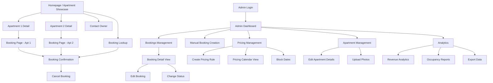
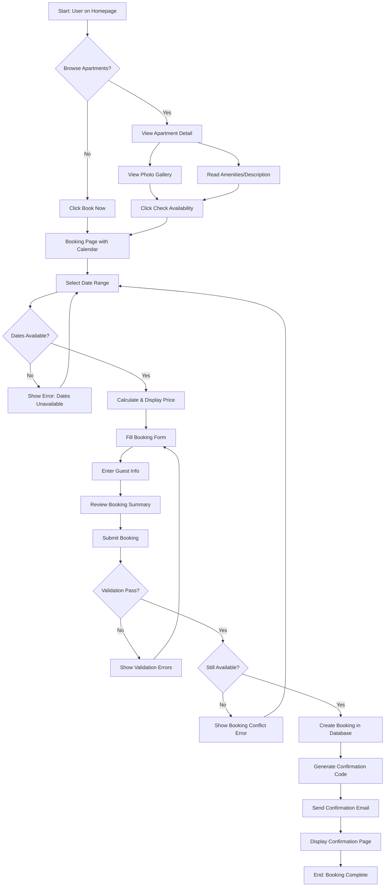
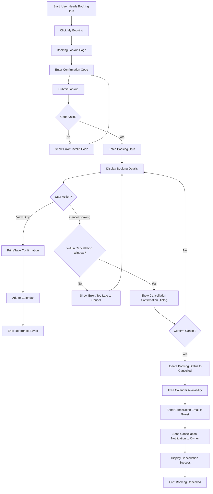
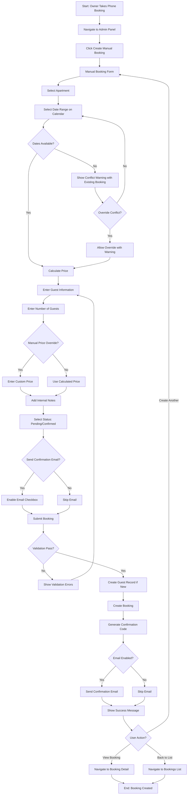

# Booking App for Two Apartments UI/UX Specification

This document defines the user experience goals, information architecture, user flows, and visual design specifications for Booking App for Two Apartments's user interface. It serves as the foundation for visual design and frontend development, ensuring a cohesive and user-centered experience.

## Overall UX Goals & Principles

### Target User Personas

**1. Budget-Conscious Travelers**

- Guests seeking direct bookings to avoid third-party commission markups
- Value transparency in pricing with no hidden fees
- Desire instant confirmation and clear communication

**2. Property Owner (Admin)**

- Busy owner managing two apartments independently
- Needs efficient tools for reservation management, pricing control, and availability oversight
- Values simplicity over complexity while maintaining powerful functionality

**3. Returning Guests**

- Previous visitors who appreciated the direct relationship with the owner
- Seek easy rebooking process and familiar interface
- May request special accommodations based on past experience

### Usability Goals

- **Ease of learning:** New guests can browse apartments and complete a booking within 5 minutes without instruction
- **Efficiency of use:** Admin can manually create a booking or update pricing in under 2 minutes
- **Error prevention:** Clear validation and confirmation for all booking submissions and admin actions
- **Immediate feedback:** Real-time calendar updates, form validation, and status changes with visual confirmation
- **Mobile-first accessibility:** Seamless experience on small phones (320px) through desktop (1024px+)

### Design Principles

1. **Transparency Above All** - Clear pricing, availability, and booking status at every step with no surprises
2. **Visual Storytelling** - High-quality apartment photography as the hero element to inspire bookings
3. **Progressive Disclosure** - Essential information first (photos, price, availability), details on demand
4. **Instant Gratification** - Real-time feedback, optimistic UI updates, and immediate confirmations
5. **Owner Empowerment** - Admin tools that feel powerful yet approachable, reducing reliance on third-party platforms

### Change Log

| Date       | Version | Description           | Author            |
| ---------- | ------- | --------------------- | ----------------- |
| 2025-10-01 | v1.0    | Initial specification | Sally (UX Expert) |

## Information Architecture (IA)

### Site Map / Screen Inventory

### Navigation Structure

**Primary Navigation (Guest-Facing):**

- **Header Navigation:** Logo/Home | Apartments | Book Now | My Booking | Contact
- **Mobile:** Hamburger menu with same items, optimized for touch
- **Sticky behavior:** Header becomes fixed on scroll for easy access to booking CTA

**Secondary Navigation (Guest-Facing):**

- **Footer:** About | Privacy Policy | Terms & Conditions | Contact Info | Social Links
- **Breadcrumbs:** Not used on guest side (shallow hierarchy, max 3 levels)

**Admin Navigation:**

- **Sidebar (Desktop):** Dashboard | Bookings | Pricing | Apartments | Analytics | Settings
- **Top Bar (Mobile):** Hamburger menu revealing same items, Admin profile/logout in top-right
- **Contextual Actions:** Appear on relevant pages (e.g., "Create Booking" button on Bookings page)

**Breadcrumb Strategy:**

- **Admin only:** Used for deep admin workflows (e.g., Dashboard > Bookings > Edit Booking #1234)
- **Guest side:** Navigation is shallow enough that breadcrumbs would add clutter; back button and clear page titles suffice

## User Flows

### Flow 1: Guest Booking Journey

**User Goal:** Complete a reservation for an apartment with selected dates

**Entry Points:**

- Homepage "Book Now" CTA
- Apartment detail page "Check Availability" button
- Direct navigation to booking page

**Success Criteria:** Booking created with 'pending' or 'confirmed' status, confirmation email sent, confirmation page displayed with booking details

#### Flow Diagram

#### Edge Cases & Error Handling:

- **Double-booking:** Real-time availability check before form submission; final check during API call with database transaction
- **Validation errors:** Inline validation with helpful messages (email format, phone format, guest count exceeds max)
- **Network failure:** Retry mechanism for email sending; booking still created with warning "Confirmation email may be delayed"
- **Session timeout:** Autosave form data to localStorage; restore on page reload
- **Price changes mid-booking:** Lock price when user begins form; warn if pricing rule changes during session
- **Minimum stay violation:** Disable submit button and show message "Minimum stay: X nights"

**Notes:** Calendar component should prevent selection of past dates and blocked dates. Consider showing "X people are viewing this apartment" social proof if implementing later.

---

### Flow 2: Booking Lookup & Cancellation

**User Goal:** Find existing booking and optionally cancel it

**Entry Points:**

- "My Booking" link in navigation
- Confirmation email link
- Homepage booking lookup section

**Success Criteria:** Guest views complete booking details; if cancellation requested, booking status updates to 'cancelled' and email notifications sent

#### Flow Diagram

#### Edge Cases & Error Handling:

- **Invalid confirmation code:** Clear error message "Booking not found. Please check your code and try again"
- **Already cancelled:** Show status prominently; disable cancel button
- **Too close to check-in:** Display message "Cancellations must be made at least 48 hours in advance. Please contact owner."
- **Network error during cancellation:** Implement retry logic; show loading state; timeout after 30 seconds with error
- **Email delivery failure:** Log error but don't block cancellation; owner receives notification through admin dashboard

**Notes:** Consider implementing a "Contact Owner" button prominently on booking details page for special requests or modifications that can't be self-served.

---

### Flow 3: Admin Manual Booking Creation

**User Goal:** Property owner creates a booking for a phone/email reservation

**Entry Points:**

- Admin dashboard "Create Manual Booking" button
- Bookings page "New Booking" button
- Quick action in top navigation

**Success Criteria:** Booking created with all details, guest record created/linked, availability updated, optional confirmation email sent

#### Flow Diagram

#### Edge Cases & Error Handling:

- **Duplicate guest detection:** Auto-suggest existing guests based on email/phone; allow linking to existing guest record
- **Conflict override:** Require confirmation with clear warning; log override action for audit trail
- **Invalid date range:** End date before start date, past dates (unless specifically allowed for historical data entry)
- **Price override validation:** Ensure positive number; flag unusually low/high prices for review
- **Form abandonment:** Warn before leaving page if form has unsaved changes
- **Guest email invalid:** Allow booking creation without email if phone booking; mark for follow-up

**Notes:** Consider prefilling form with most recent guest's info for returning guests. Add "Quick Book" template for common scenarios (weekend stay, week stay).

## Wireframes & Mockups

**Primary Design Files:** _To be created in Figma/Sketch (link to be added once designs are created)_

For now, the following conceptual layouts serve as reference for the most critical screens during implementation.

### Key Screen Layouts

#### Screen 1: Homepage / Apartment Showcase

**Purpose:** First impression that captures attention, showcases both apartments attractively, and drives users toward booking

**Key Elements:**

- Hero section with high-quality featured image (alternating between apartments or slideshow)
- Clear value proposition headline: "Book Directly. No Commissions. Instant Confirmation."
- Two apartment cards displayed side-by-side (grid on desktop, stacked on mobile)
- Each card includes: primary photo, apartment name, "From €XX/night", max guests icon, prominent "View Details" CTA
- Booking lookup widget (search by confirmation code) in hero or below fold
- Trust indicators: "Instant Confirmation", "Direct Owner Contact", "Flexible Cancellation"
- Contact section with owner photo and brief message
- Footer with essential links

**Interaction Notes:** Cards have subtle hover effect (shadow elevation, slight scale). Hero image uses parallax scrolling on desktop for depth. Sticky header appears after scrolling past hero. Framer Motion page transition when navigating to apartment detail.

**Design File Reference:** _[Homepage - Desktop & Mobile views]_

---

#### Screen 2: Apartment Detail Page

**Purpose:** Provide comprehensive apartment information to help guests make informed booking decisions

**Key Elements:**

- Full-width photo gallery at top (primary image with thumbnail navigation)
- Apartment name and tagline
- Quick stats bar: Max Guests, Bedrooms, Bathrooms, Size
- Sticky booking widget (mobile: bottom sheet, desktop: sidebar) showing: "From €XX/night", date selector preview, "Check Availability" CTA
- Amenities section with icons (WiFi, Kitchen, AC, Parking, etc.)
- Detailed description with expandable "Read More"
- Location map (embedded Google Maps)
- House rules and policies (expandable accordion)
- Owner contact card with "Send Message" button

**Interaction Notes:** Photo gallery is swipeable on mobile, click navigation on desktop. Lightbox modal for full-screen image viewing. Sticky booking widget follows scroll, converts to FAB on mobile. Smooth scroll to booking calendar when "Check Availability" clicked. Lazy load images below fold for performance.

**Design File Reference:** _[Apartment Detail - Desktop & Mobile]_

---

#### Screen 3: Booking Page with Calendar & Form

**Purpose:** Enable seamless date selection, price calculation, and booking submission in one cohesive flow

**Key Elements:**

- Apartment summary card (photo, name, key details) at top
- Interactive calendar component (highlighted: booked dates, blocked dates, selected range)
- Price calculation panel updating in real-time: nights count, rate per night, total price
- Booking form fields: First Name, Last Name, Email, Phone, Number of Guests (dropdown), Special Requests (textarea)
- Booking summary panel: dates, guests, price breakdown, confirmation of terms
- Prominent "Complete Booking" button (disabled until form valid)
- Progress indicator if multi-step form
- Security badges: "Secure Booking", "Instant Confirmation"

**Interaction Notes:** Calendar disables past dates and conflicting bookings automatically. Price updates with smooth number animation when dates change. Form uses real-time validation with inline error messages. Optimistic UI: show loading state on submit, then success animation. Autosave form data to localStorage every 30 seconds. On mobile: booking summary becomes sticky footer with expandable details.

**Design File Reference:** _[Booking Page - Calendar View & Form View]_

---

#### Screen 4: Booking Confirmation Page

**Purpose:** Provide clear confirmation, booking details, and next steps for guests

**Key Elements:**

- Large success icon/animation (checkmark with Framer Motion)
- Confirmation message: "Booking Confirmed! We've sent details to [email]"
- Confirmation code prominently displayed in large, copyable text
- Booking summary card: apartment, dates, guests, total price
- Action buttons: "Add to Calendar" (.ics download), "Print Confirmation", "Email Again"
- What happens next section: check-in instructions preview, owner contact info
- "Cancel Booking" link (smaller, less prominent)
- Related actions: "Book Another Apartment", "Contact Owner"

**Interaction Notes:** Entry animation with Framer Motion (fade + slide from bottom). One-click copy confirmation code to clipboard with toast feedback. Print stylesheet optimized for clean confirmation printout. Responsive layout: stacked on mobile, two-column on desktop.

**Design File Reference:** _[Confirmation Page - Success State]_

---

#### Screen 5: Admin Dashboard

**Purpose:** Give property owner at-a-glance view of today's activity and recent bookings

**Key Elements:**

- Welcome header with date and quick stats (total bookings this month, revenue, occupancy %)
- Today's Activity section: Check-ins Today (card list), Check-outs Today (card list)
- Quick Actions: "Create Manual Booking", "View All Bookings", "Manage Pricing" (prominent buttons)
- Recent Bookings widget: last 10 bookings with status badges, click to view detail
- Mini calendar showing next 30 days with booking density
- Alerts/notifications section: pending bookings needing confirmation, low occupancy warnings

**Interaction Notes:** Auto-refresh every 5 minutes for real-time updates. Quick status change from booking cards (confirm/cancel actions). Click any booking card to navigate to detail view. Notifications are dismissible with X button. Responsive: widgets stack on tablet/mobile.

**Design File Reference:** _[Admin Dashboard - Desktop & Tablet]_

---

#### Screen 6: Admin Bookings Management

**Purpose:** Comprehensive view and management of all bookings with filtering and search

**Key Elements:**

- Page header with "Bookings" title and "Create Booking" CTA
- Filter bar: Status dropdown (All/Pending/Confirmed/Cancelled), Apartment filter, Date range picker, Search input
- Bookings table (desktop) / cards (mobile): Confirmation Code, Guest Name, Apartment, Check-in, Check-out, Nights, Status Badge, Price, Actions (vertical dots menu)
- Pagination controls at bottom (showing "10 of 45 bookings")
- Bulk actions: Select multiple bookings, change status dropdown
- Export button in header (CSV/Excel)
- Empty state: "No bookings found" with illustration and "Create First Booking" CTA

**Interaction Notes:** Table rows are clickable (navigate to booking detail). Status badges color-coded: Green (confirmed), Yellow (pending), Red (cancelled). Actions menu: View Details, Edit, Change Status, Cancel, Delete. Filter selections persist in URL for shareable links. Skeleton loading state while fetching data. Mobile: swipe row left to reveal quick actions.

**Design File Reference:** _[Bookings Management - List View]_

---

#### Screen 7: Admin Pricing Management

**Purpose:** Configure seasonal pricing rules and view pricing calendar

**Key Elements:**

- Tab navigation: "Pricing Rules" | "Pricing Calendar" | "Base Prices"
- Pricing Rules tab: table listing all rules (name, apartment, date range, price, min stay, actions)
- "Create Pricing Rule" button prominently displayed
- Calendar tab: visual month view showing daily prices color-coded by rule
- Base Prices tab: cards for each apartment with inline editable price field
- Filter by apartment, active/inactive status
- Visual conflict warnings (overlapping rules highlighted)

**Interaction Notes:** Calendar view: click date to create rule or edit price. Quick edit: inline editing for rule name and price. Delete confirmation dialog for rules. Hover tooltips on calendar showing full rule details. Toggle between apartments in calendar view.

**Design File Reference:** _[Pricing Management - Rules & Calendar Views]_

## Component Library / Design System

**Design System Approach:** Utilize **shadcn/ui** as the foundation component library (built on Radix UI primitives) with TailwindCSS for styling. This provides accessible, customizable components that align with modern design standards. Custom components will be built for booking-specific interactions (calendar, price calculator, booking cards).

### Core Components

#### Component: Button

**Purpose:** Primary interaction element for CTAs and actions throughout the application

**Variants:**

- `primary` - Main CTAs (Book Now, Complete Booking, Confirm)
- `secondary` - Supporting actions (View Details, Cancel)
- `outline` - Tertiary actions (Export, Filter)
- `ghost` - Subtle actions (navigation, close)
- `destructive` - Dangerous actions (Delete, Cancel Booking)

**States:** `default`, `hover`, `active`, `disabled`, `loading`

**Usage Guidelines:** Use primary buttons sparingly (one per screen section). Always provide loading state for async actions. Destructive actions require confirmation dialogs.

---

#### Component: Card

**Purpose:** Container for grouping related content (apartment listings, booking details, dashboard widgets)

**Variants:**

- `default` - Standard card with shadow
- `elevated` - Hover state with increased shadow
- `interactive` - Clickable cards with hover effects
- `outlined` - Border only, no shadow

**States:** `default`, `hover`, `selected`, `disabled`

**Usage Guidelines:** Use consistent padding (p-6 for desktop, p-4 for mobile). Interactive cards should have clear hover affordance. Nest related information logically.

---

#### Component: Calendar

**Purpose:** Date selection for bookings with availability visualization

**Variants:**

- `booking-calendar` - Guest-facing calendar with simplified controls
- `admin-calendar` - Admin calendar with additional management features
- `mini-calendar` - Dashboard widget showing overview

**States:** `available`, `booked`, `blocked`, `selected`, `past`, `loading`

**Usage Guidelines:** Always disable past dates. Use color-coding consistently (green=available, red=booked, gray=blocked). Provide legend for date states. Mobile: optimize for touch with larger date cells.

---

#### Component: Form Input

**Purpose:** Text input fields for forms (guest info, booking details)

**Variants:**

- `text` - Standard text input
- `email` - Email with validation
- `phone` - Phone number with formatting
- `number` - Numeric input with steppers
- `textarea` - Multi-line text for notes

**States:** `default`, `focus`, `error`, `success`, `disabled`

**Usage Guidelines:** Always provide labels (not just placeholders). Show validation inline with helpful error messages. Use appropriate input types for mobile keyboards. Implement autofocus on first field.

---

#### Component: Status Badge

**Purpose:** Visual indicator for booking status and other state information

**Variants:**

- `pending` - Yellow/amber color
- `confirmed` - Green color
- `cancelled` - Red color
- `completed` - Blue/gray color

**States:** `default`, `with-icon`

**Usage Guidelines:** Use consistent color scheme across application. Include icon when space permits. Ensure adequate color contrast for accessibility.

---

#### Component: Modal/Dialog

**Purpose:** Focused interactions and confirmations that require user attention

**Variants:**

- `default` - Standard modal for forms/content
- `alert` - Warning or confirmation dialogs
- `fullscreen` - Mobile-optimized full-screen modals

**States:** `open`, `closing`, `closed`

**Usage Guidelines:** Always provide close button (X). Use escape key to close. Implement focus trap. Prevent body scroll when open. Animate entry/exit with Framer Motion.

---

#### Component: Toast Notification

**Purpose:** Non-intrusive feedback for actions and system messages

**Variants:**

- `success` - Green with checkmark
- `error` - Red with error icon
- `warning` - Yellow with warning icon
- `info` - Blue with info icon

**States:** `entering`, `visible`, `exiting`

**Usage Guidelines:** Auto-dismiss after 5 seconds (error: 7 seconds). Stack multiple toasts vertically. Position top-right on desktop, top-center on mobile. Swipe to dismiss on mobile.

---

#### Component: Loading Skeleton

**Purpose:** Placeholder content during data fetching to improve perceived performance

**Variants:**

- `text` - Lines of varying widths
- `card` - Card-shaped placeholder
- `image` - Rectangle with subtle animation
- `list` - Multiple rows

**States:** `loading`

**Usage Guidelines:** Match skeleton shape/size to actual content. Use subtle pulse animation. Replace with actual content without layout shift.

---

#### Component: Data Table

**Purpose:** Display and manage lists of bookings, pricing rules, guests

**Variants:**

- `default` - Standard table with sorting
- `selectable` - Checkboxes for bulk actions
- `expandable` - Rows expand for details

**States:** `default`, `sorted`, `loading`, `empty`

**Usage Guidelines:** Make headers sortable where appropriate. Provide pagination for large datasets. Convert to card layout on mobile. Always include empty state with CTA.

---

#### Component: Booking Card

**Purpose:** Custom component displaying booking summary information

**Variants:**

- `guest-view` - Simplified view for guests
- `admin-view` - Detailed view with actions
- `compact` - Minimal info for lists

**States:** `default`, `expandable`, `selected`

**Usage Guidelines:** Show key info at glance (dates, apartment, guest, status). Provide quick actions in admin view. Make clickable for detail navigation.

## Branding & Style Guide

### Visual Identity

**Brand Guidelines:** _To be finalized with property owner. For now, prioritizing clean, professional aesthetic that emphasizes apartment quality and trustworthiness._

**Brand Personality:**

- Professional yet approachable
- Trustworthy and transparent
- Modern and efficient
- Guest-focused and welcoming

### Color Palette

| Color Type | Hex Code | Usage                                                      |
| ---------- | -------- | ---------------------------------------------------------- |
| Primary    | #2563EB  | Primary CTAs, active states, links, brand elements         |
| Secondary  | #10B981  | Success states, confirmed bookings, available dates        |
| Accent     | #F59E0B  | Pending states, highlights, promotional elements           |
| Success    | #059669  | Positive feedback, confirmations, successful actions       |
| Warning    | #D97706  | Cautions, important notices, pending actions               |
| Error      | #DC2626  | Errors, destructive actions, cancelled bookings, conflicts |
| Neutral    | #6B7280  | Text, borders, backgrounds, disabled states                |

**Additional Neutrals:**

- Background: #FFFFFF (light mode primary), #F9FAFB (light gray)
- Text Primary: #111827 (near black)
- Text Secondary: #6B7280 (medium gray)
- Text Tertiary: #9CA3AF (light gray)
- Border: #E5E7EB (light gray)

### Typography

#### Font Families

- **Primary:** Inter (modern, clean, excellent readability across sizes)
- **Secondary:** Inter (consistent throughout - no need for second family)
- **Monospace:** JetBrains Mono (for confirmation codes, technical data)

**Rationale:** Inter is a versatile, modern sans-serif optimized for screens. Its extensive weight options provide flexibility while maintaining consistency.

#### Type Scale

| Element | Size | Weight | Line Height |
| ------- | ---- | ------ | ----------- |
| H1      | 36px | 700    | 1.2         |
| H2      | 30px | 600    | 1.3         |
| H3      | 24px | 600    | 1.4         |
| Body    | 16px | 400    | 1.6         |
| Small   | 14px | 400    | 1.5         |

**Mobile Adjustments:**

- H1: 28px (scaled down for mobile)
- H2: 24px
- H3: 20px

### Iconography

**Icon Library:** lucide-react (consistent, modern, extensive icon set with excellent React support)

**Usage Guidelines:**

- Default icon size: 20px for inline use, 24px for standalone buttons
- Icon color should match text color in most cases
- Use filled icons sparingly for emphasis (status indicators, primary actions)
- Maintain consistent stroke width (2px for lucide-react default)
- Always provide aria-labels for icon-only buttons

**Key Icons:**

- Calendar: CalendarDays
- User/Guest: User, Users
- Location: MapPin
- Amenities: Wifi, Utensils, Car, Waves, etc.
- Actions: Check, X, Edit, Trash2, MoreVertical
- Status: CheckCircle2, AlertCircle, XCircle, Clock

### Spacing & Layout

**Grid System:** 12-column grid with responsive gutters

- Desktop (1024px+): 24px gutters
- Tablet (768px): 16px gutters
- Mobile (<768px): 12px gutters

**Spacing Scale:** Based on 4px base unit (Tailwind default)

- xs: 4px (0.25rem)
- sm: 8px (0.5rem)
- md: 16px (1rem)
- lg: 24px (1.5rem)
- xl: 32px (2rem)
- 2xl: 48px (3rem)
- 3xl: 64px (4rem)

**Container Max Widths:**

- Small: 640px (form-focused pages)
- Medium: 768px (content pages)
- Large: 1024px (main application width)
- XL: 1280px (wide dashboards)

**Component Spacing Guidelines:**

- Card padding: 24px (desktop), 16px (mobile)
- Section spacing: 48px between major sections
- Form field spacing: 16px between fields
- Button padding: 12px vertical, 24px horizontal (medium)

## Accessibility Requirements

### Compliance Target

**Standard:** WCAG 2.1 Level AA compliance

**Rationale:** Level AA provides a strong baseline for accessibility without the extensive requirements of AAA, making it achievable for MVP while serving the vast majority of users with disabilities.

### Key Requirements

**Visual:**

- Color contrast ratios: Minimum 4.5:1 for normal text, 3:1 for large text (18px+ or 14px+ bold) and UI components
- Focus indicators: 2px solid outline with high contrast color (default browser or custom blue #2563EB) visible on all interactive elements
- Text sizing: All text must be resizable up to 200% without loss of content or functionality; use rem/em units instead of px

**Interaction:**

- Keyboard navigation: All interactive elements accessible via Tab, Enter/Space activates buttons/links, Escape closes modals/dialogs
- Screen reader support: Proper semantic HTML (nav, main, article, aside), ARIA labels for all icons and dynamic content, announce live regions for toasts and updates
- Touch targets: Minimum 44x44px for all interactive elements on mobile, adequate spacing between clickable elements to prevent accidental taps

**Content:**

- Alternative text: All images have descriptive alt text; decorative images use alt="" to hide from screen readers
- Heading structure: Logical hierarchy (H1 → H2 → H3), no skipping levels, single H1 per page
- Form labels: Every form field has associated label element (for/id relationship), error messages programmatically associated with fields (aria-describedby)

### Testing Strategy

**Manual Testing:**

- Keyboard-only navigation through all user flows
- Screen reader testing (NVDA/JAWS on Windows, VoiceOver on macOS/iOS)
- Color contrast verification using tools (Contrast Checker, axe DevTools)
- Text zoom testing (200% zoom in browser)

**Automated Testing:**

- Integration of axe-core or Pa11y in development workflow
- Lighthouse accessibility audits in CI/CD pipeline
- ESLint plugin jsx-a11y for catching common issues during development

**User Testing:**

- Recruit users with disabilities for UAT (screen reader users, keyboard-only users)
- Test across various assistive technologies
- Document and prioritize feedback for iterations

## Responsiveness Strategy

### Breakpoints

| Breakpoint | Min Width | Max Width | Target Devices                          |
| ---------- | --------- | --------- | --------------------------------------- |
| Mobile     | 320px     | 767px     | Small to standard phones (iPhone SE-14) |
| Tablet     | 768px     | 1023px    | Tablets (iPad, Android tablets)         |
| Desktop    | 1024px    | 1279px    | Laptops, small desktops                 |
| Wide       | 1280px    | -         | Large desktops, external monitors       |

### Adaptation Patterns

**Layout Changes:**

- Mobile: Single column, stacked content, bottom sheets for overlays
- Tablet: Two-column layouts where appropriate (apartment cards), hybrid navigation (sidebar can collapse)
- Desktop: Multi-column layouts, persistent sidebars, hover interactions
- Wide: Maximum content width (1280px) with centered container, additional whitespace

**Navigation Changes:**

- Mobile: Hamburger menu with full-screen drawer, bottom-fixed booking CTAs
- Tablet: Compressed navigation, icons with labels, collapsible admin sidebar
- Desktop: Full horizontal navigation (guest), persistent sidebar (admin)
- Wide: Same as desktop with increased padding

**Content Priority:**

- Mobile: Hero image smaller, essential info first, "Read more" expansions, hide secondary details in accordions
- Tablet: Balanced content display, side-by-side booking form and calendar
- Desktop: All content visible, minimal progressive disclosure
- Wide: Enhanced imagery, more whitespace for comfort

**Interaction Changes:**

- Mobile: Touch-optimized (44px targets), swipe gestures, bottom sheets, pull-to-refresh
- Tablet: Hybrid touch/mouse support, moderate target sizes
- Desktop: Mouse/keyboard primary, hover states, keyboard shortcuts
- Wide: Enhanced hover effects, tooltips with more detail

## Animation & Micro-interactions

### Motion Principles

**Core Animation Philosophy:**

- **Purposeful, not decorative:** Every animation should serve usability (feedback, guidance, relationships)
- **Quick and subtle:** Most animations 200-300ms for responsiveness
- **Respectful of preferences:** Honor prefers-reduced-motion for accessibility
- **Natural easing:** Use easeOut for entrances, easeIn for exits, easeInOut for transitions

**Framer Motion Implementation:**

- Leverage AnimatePresence for mount/unmount animations
- Use variants for consistent, reusable animation patterns
- Implement layout animations for responsive changes
- Respect reduced motion with useReducedMotion hook

### Key Animations

- **Page Transitions:** Fade + slight upward slide on page load (Duration: 300ms, Easing: easeOut)
- **Modal Entry:** Scale from 0.95 to 1.0 with fade (Duration: 200ms, Easing: easeOut)
- **Modal Exit:** Fade out with slight scale down (Duration: 150ms, Easing: easeIn)
- **Toast Notifications:** Slide in from right with fade (Duration: 250ms, Easing: easeOut)
- **Button Hover:** Subtle scale to 1.02 with shadow increase (Duration: 150ms, Easing: easeInOut)
- **Card Hover:** Elevation increase with shadow transition (Duration: 200ms, Easing: easeOut)
- **Loading Skeletons:** Gentle pulse animation (Duration: 1500ms, Easing: easeInOut, Infinite)
- **Success Checkmark:** Draw animation for SVG path (Duration: 400ms, Easing: easeOut)
- **Calendar Date Selection:** Background color fade (Duration: 200ms, Easing: easeOut)
- **Form Validation:** Shake animation for errors (Duration: 400ms, Easing: easeInOut)
- **Number Counter:** Animated count-up for price changes (Duration: 500ms, Easing: easeOut)
- **Image Gallery:** Smooth crossfade between images (Duration: 300ms, Easing: easeInOut)

## Performance Considerations

### Performance Goals

- **Page Load:** First Contentful Paint < 1.5s, Largest Contentful Paint < 2.5s
- **Interaction Response:** Time to Interactive < 3.0s, First Input Delay < 100ms
- **Animation FPS:** Maintain 60fps for all animations, drop to static if frames drop below 30fps

### Design Strategies

**Image Optimization:**

- Use Next.js Image component with automatic optimization
- Implement WebP/AVIF with JPEG fallbacks
- Lazy load below-the-fold images
- Provide blur-up placeholders for better perceived performance
- Size images appropriately for breakpoints (don't serve 4K to mobile)

**Code Splitting:**

- Dynamic imports for admin panel (guests never load admin code)
- Calendar component loaded on-demand when booking page accessed
- Analytics and reporting components lazy-loaded
- Vendor chunks separated for better caching

**Critical Rendering Path:**

- Inline critical CSS for above-the-fold content
- Defer non-critical JavaScript
- Preload fonts (Inter) to prevent FOIT/FOUT
- Server-side render initial apartment listings for instant content

**Bundle Size Management:**

- Tree-shake unused code (especially from UI libraries)
- Compress images and assets
- Minify and compress JavaScript/CSS
- Use compression (gzip/brotli) on server

**Runtime Performance:**

- Implement virtual scrolling for long booking lists (if needed)
- Debounce search inputs (300ms)
- Memoize expensive calculations (React.memo, useMemo)
- Optimize re-renders with proper React patterns

## Next Steps

### Immediate Actions

1. **Create high-fidelity mockups** in Figma based on wireframes and style guide
2. **Build component library** starting with foundational components (Button, Card, Input)
3. **Establish design tokens** in Tailwind config matching color palette and spacing scale
4. **Set up Storybook** for component documentation and visual testing
5. **Conduct stakeholder review** of visual design direction and brand alignment
6. **Begin frontend architecture** planning with development team

### Design Handoff Checklist

- [x] All user flows documented
- [x] Component inventory complete
- [x] Accessibility requirements defined
- [x] Responsive strategy clear
- [x] Brand guidelines incorporated
- [x] Performance goals established
- [ ] High-fidelity mockups created in Figma
- [ ] Design tokens implemented in code
- [ ] Component library built in Storybook
- [ ] Developer handoff meeting scheduled
- [ ] Design QA process established
